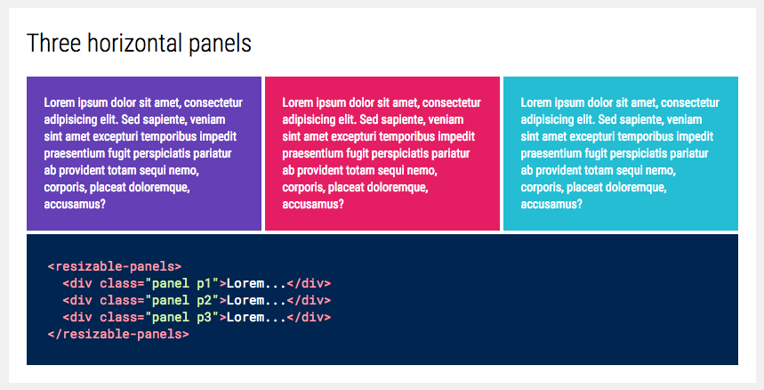

# resizable-panels
[](https://www.webcomponents.org/element/kcmr/resizable-panels)
[](https://kcmr.github.io/resizable-panels/components/resizable-panels/demo/index.html)

`<resizable-panels>` allows to resize the width (default) or the height (vertical mode) of the component childrens.

<!---
```html
<custom-element-demo>
  <template>
    <script src="../webcomponentsjs/webcomponents-lite.js"></script>
    <link rel="import" href="resizable-panels.html">
    <style>
    .panel { padding: 20px; color: white; font-family: sans-serif; width: 50%; }
    .p1 { background-color: #E91E63; }
    .p2 { background-color: #00BCD4; }
    </style>
    <next-code-block></next-code-block>
  </template>
</custom-element-demo>
```
-->  
```html
    <resizable-panels>
      <div class="panel p1">Lorem ipsum dolor…</div>
      <div class="panel p2">Second panel</div>
    </resizable-panels>
```

Vertical mode:

```html
    <resizable-panels vertical>
      <div>Lorem ipsum dolor…</div>
      <div>Second panel</div>
      <div>Third panel</div>
    </resizable-panels>
```

## Events

- `resizing`: 
Fired when the panels are resized and when the resize ends.   
@param {Object} detail { state: start|end }


## Styling

The following custom CSS properties are available for styling:

| Custom property                | Description                             | Default     |
|:-------------------------------|:----------------------------------------|------------:|
| --resizable-panels-knob-size   | width (default) or height of the knobs  | 4px         |
| --resizable-panels-knob-color  | background color of the knobs           | #fff        |
| --resizable-panels-knob        | Mixin applied to the knob               | {}          |

## Demo

[Demo and API docs](https://kcmr.github.io/resizable-panels/components/resizable-panels/)

## Install

Install the component using [Bower](http://bower.io/):

```bash
$ bower i -S kcmr/resizable-panels
```

## Usage

Import Web Components polyfill:

```js
<script src="bower_components/webcomponentsjs/webcomponents-lite.js"></script>
```

Import Custom Element:

```html
<link rel="import" href="bower_components/resizable-panels/resizable-panels.html"> 
```

Use it!
