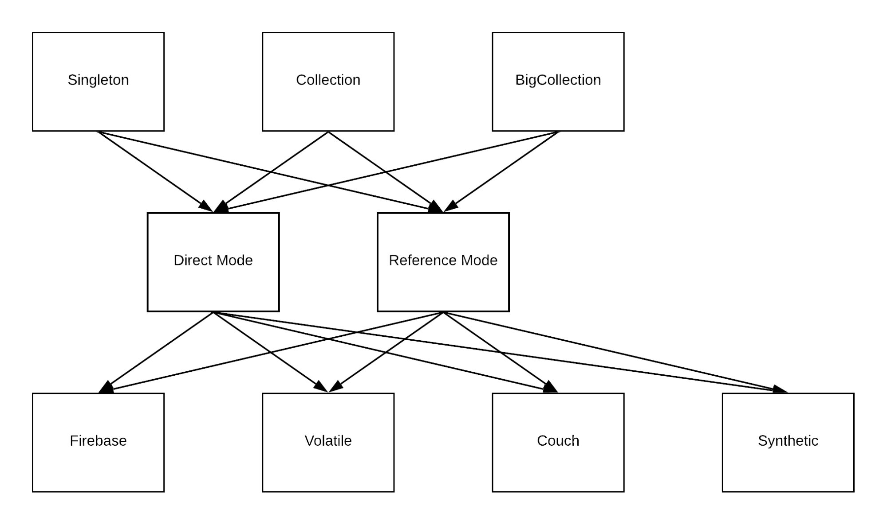
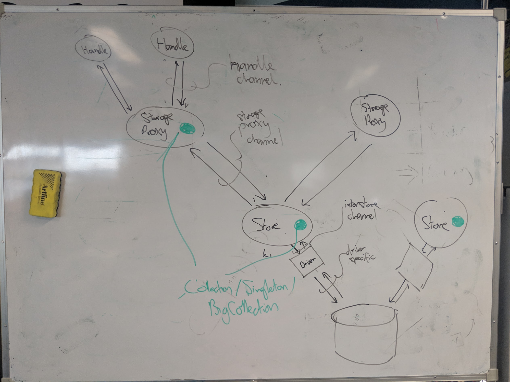
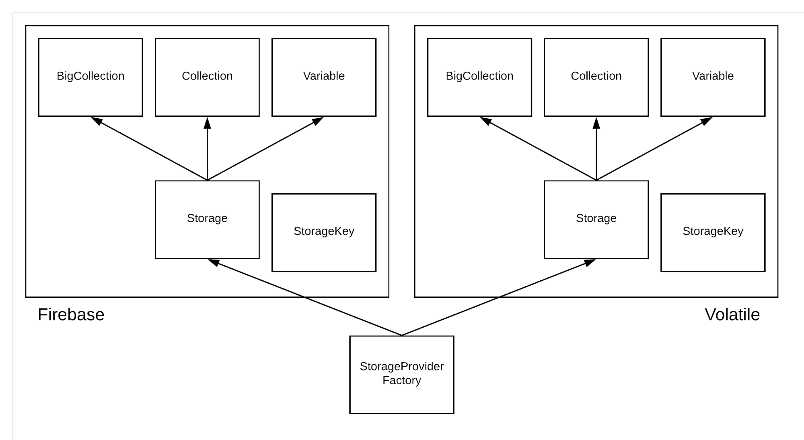

# Storage Refactor

_shans@, Oct 2018_


## Motivation

The current layout of storage classes means that:


* timing logic is duplicated across every storage provider
* timing logic is distributed within each storage provider

This causes bugs which are difficult to track down, and difficult to consistently fix once found. This refactor aims to surface timing logic as a primary consideration, by reimplementation storage as timing-aware StorageEngines (one for local mode, one for reference mode) that operate on CRDTStorage backends.


## Side Benefits

While refactoring storage, we will additionally:


* simplify the process of adding new storage backends. Currently, an implementation must provide:
    * a StorageKey class (this represents storageKeys of the implementation)
    * a Storage class (this provides an entry point for construction of/connection to stores)
    * a Collection class
    * a Variable class
    * a BigCollection class

	This refactor aims to reduce the number of additional classes required to 2:


    * A StorageKey class
    * A StorageDriver class which handles storage and retrieval of CRDT models
* allow partial fetching of CRDT collections from storage implementations, to support better performance when operating in referenceMode
* coalesce existing Collection, Variable and BigCollection classes into a single representation of each, to enforce consistency and easier opaque referencing from outside of the storage subsystem.


## Existing Design





Currently, a StorageProviderFactory handles top-level requests and vends them to the appropriate Storage (subclass of StorageProviderBase) engine. This engine in turn constructs an engine-specific instance of BigCollection, Collection or Variable and returns it through the factory to the caller. The Store instance handles data requests with a type-specific API.

Engines are registered with the StorageProviderFactory at runtime, which allows specific environments to select the set of engines they wish to make available.

Per-engine StorageKey classes (subclasses of KeyBase) parse & serialize storage keys for each engine.


### Classes Above Storage

Each Storage subclass (e.g. FirebaseBigCollectionStore, or VolatileCollectionStore) communicates using an API specific to its data type (BigCollection, Collection or Variable) with StorageProxies, which execute inside particle isolation barriers. StorageProxies in turn communicate with Handles, which communicate with the Particles themselves.

The existing design is set up to try and isolate concerns which are specific to a backend technology (Firebase, pouch, etc.) within the specific class hierarchy for that technology. Hence, no firebase-specific considerations should exist within StorageProxies.

Arcs-specific concerns are somewhat more poorly localised. Some things are kept hidden at the StorageProxy layer (or above) - however the fact that BigCollection, Collection and Variable subclasses leak down to the engine layer means that each engine implementation needs to understand a great deal about Arcs data abstractions. A goal of this redesign is to remove that requirement.


### Arcs Concepts That Leak Into Storage


#### CRDT Keys

Collection & BigCollection APIs that add or remove data require a keys argument. Keys are unique values constructed by CRDT clients that track per-client visibility of additions and removals.

From the perspective of Storage engines, keys are opaque strings used by the CRDT Model to determine the impact of a given addition or removal in terms of local state change.

Note that BigCollections don’t currently implement a CRDT model, and hence doesn’t make use of the keys other than to store them into the backing datastore.


#### OriginatorId

OriginatorId values are provided by StorageProxies, with the understanding that any events generated locally by a Storage object will copy the originatorId back into the event. This allows StorageProxies to suppress events corresponding to changes initiated by the StorageProxy (note that these events are immediately delivered by the Proxy when the change is sent, so the asynchronous notification of that change would be a duplication).

Hence, OriginatorIds need to be unique for each StorageProxy; from the perspective of Storage they are opaque strings.

**Note:** In the current implementation, OriginatorIds are particleIds, and used by the StorageProxy only to skip notification _of that particle _(and only for Collections). This seems to either imply slow updates of other particles connected to the same proxy, or alternatively duplicate updates to those particles.

OriginatorIds are ignored by BigCollections as BigCollections don’t send events in response to changes.


#### Barriers

Barriers are also provided by StorageProxies, and are also expected to be copied back in relevant events. The differences between Barriers and OriginatorIds are:


1. Barriers are used by Variables (not Collections)
2. Barriers are sent _after_ changes are persisted to the backing store, while OriginatorIds are sent _before_ changes are persisted.

Barriers are ignored by BigCollections.


#### BarrierVersions

Note that barrierVersions are not the same as barriers!

Collections track a list of ‘suppressions’. Each suppression maps a key to a barrierVersion. Any updates from a storage engine that reference that key are suppressed from generating events until the datastore is at the listed barrierVersion.


### Storage Concepts to Preserve


#### BigCollections

The current BigCollection API provides the ability to stream the contents of a handle up to a watermark. Any new writes to the collection get inserted after the watermark, which means writes never appear in any streams ongoing when the write occurs. Removal of elements within a stream’s boundaries will be deferred from the perspective of the streamer until after the stream has completed. However, removal deferment is strictly local and the element is removed immediately from all other perspectives.

BigCollections are implemented using firebase-specific functionality to support slices and concurrent modification. This does imply that BigCollections are **not** under CRDT control - for example, it’s possible for a key removal to impact additions that are not causally ordered. 

It’s possible that the requirements of BigCollections can be translated to other storage mechanisms too, but this hasn’t been investigated.


#### Reference Mode

Collections and Variables as used by arcs directly are currently constructed in reference mode. This means that only a (storageKey, entityId) pair are stored locally, while the actual data comprising the entity is written into a backing store (which, in contrast, is in _direct mode_). Both backing stores and reference mode collections are implemented by the same collection classes.

Eventually the indirection performed by reference mode stores will happen in an adapter located in a Handle adjacent to a Particle. At this point, all stores will be direct mode but most of the reads and writes to/from collections will be of Reference objects.


#### Storage Proxies

Storage Proxies currently provide a range of behaviours (through Handles) to particles - for example:


* They can be configured to hide synchronization of models so that the model appears to be always local from the particle perspective
* They can be configured to act as a raw event source for storage; in this case there’s no local model and the particle just sees events as they arrive

There are 4 options available to storage proxies - note that these options are currently per-handle, not per-proxy:


* keepSynced
* notifySync
* notifyUpdate
* notifyDesync


#### Synthetic Storage

Synthetic Storage nodes use information in their addressing storageKey to reflect back on other forms of storage. As such, synthetic stores are able to make direct connections to other stores and extract information. For example, there’s a synthetic store that opens a storage location corresponding to an arc’s serialization, then parses the recipe and presents all handles found within the arc, structured as a collection.


### StorageProviderFactory API

This is the API that drives each of the underlying engines.


```
construct(id: string, type: Type, keyFragment: string) : Promise<StorageProviderBase>
```


Constructs a new Store. The keyFragment doesn’t need to be a complete key (though this is implementation-dependent) but can’t reference existing storage.


```
connect(id: string, type: Type, key: string) : Promise<StorageProviderBase>
```


Connects to an existing Store. The key must be complete and reference existing storage of the provided type.


```
baseStorageFor(type: Type, key: string) : Promise<StorageProviderBase>
```


Provides shared access to an underlying store. This is guaranteed not to be in referenceMode.


```
baseStorageKey(type: Type, key: string) : string
```


Provides the canonical key for the provided type. Note that this may require a valid storageKey string (e.g. firebase canonical stores are always in the same firebase instance as their reference tables).


```
parseStringAsKey(s: string) : KeyBase
```


Converts a string into a StorageKey of the appropriate type.


### StorageEngine APIs

When adding a new storage engine, these are the APIs that you’re currently required to add. Note that these APIs are somewhat, sort of, replicated at the StorageProxy layer and at the Handle layer. 


#### BigCollection API


```
get(id: string) : Promise<EntityJSON>
```


Retrieves the Entity identified by the provided id.


```
store(value: EntityJSON, keys: string[], originatorId: string) : Promise<void>
```


Stores an Entity, ignoring the provided CRDT keys and originatorId.


```
remove(id: string, keys: string[], originatorId: string): Promise<void>
```


Removes the Entity identified by the provided id, ignoring the provided CRDT keys and originatorId.


```
stream(pageSize: number, forward: bool = true) : Promise<number>
```


Set up a new stream with provided pageSize. The stream will iterate over the data contained by the BigCollection in forwards direction is forward is true, otherwise in reverse direction. This method returns an identifier referencing the constructed cursor. This stream operates at a fixed version (i.e. changes to the BigCollection that occur after a stream call will not be reflected in that stream).


```
cursorNext(cursorId: number) : Promise<{value: EntityJSON[], done: boolean}>
```


Get the next page of data from the cursor identified by the provided cursorId. The page consists of a value array and a done flag.


```
cursorClose(cursorId: number) : void
```


Close the cursor identified by the provided cursorId.


```
cursorVersion(cursorId: number) : number
```


Return the version against which the cursor identified by the provided cursorId was constructed.


#### Collection API


```
get(id: string): Promise<EntityJSON>
```


Retrieves the Entity identified by the provided id.


```
removeMultiple(ids: string[], originatorId: string) : Promise<void>
```


Removes the entities referenced by the provided ids, tracking the provided originatorId.


```
remove(id: string, keys: string[], originatorId: string) : Promise<void>
```


Removes the entity referenced by the provided id, tracking the provided originatorId.


```
store(value: EntityJSON, keys: string[], originatorId: string) : Promise<void>
```


Stores the provided entity, using provided keys and originatorId.


```
toList() : Promise<EntityJSON[]>
```


Returns all stored entities as a list.


```
getMultiple(ids: string[]) : Promise<EntityJSON[]>
```


Returns entities referenced by provided ids .


```
storeMultiple(values: EntityJSON[], keys: string[], originatorId: string) : Promise<void>
```


Stores the provided entities, using provided keys and originatorId.


```
modelForSynchronization() : Promise<{model: {id: string, value: EntityJSON}[]}>
```


Returns all stored entities as a CRDT model serialization.


#### Variable API


```
get() : Promise<EntityJSON>
```


Returns the stored entity.


```
set(value: EntityJSON, originatorId: string, barrier: string) : Promise<void>
```


Sets the stored entity to the provided value, tracking originatorId and barrier.


```
clear(originatorId: string, barrier: string) : Promise<void>
```


Clears the stored entity, tracking the provided barrier.


```
modelForSynchronization() : Promise<{model: {id: string, value: EntityJSON}[]}>
```


Returns the stored entity as a CRDT model serialization.


## Redesign Overview





This diagram illustrates the desired layout at a high-level: there’s one handle class for each API presented to the user, one implementation of direct mode and one of reference mode stores, and a single driver for each storage implementation.


### Requirements

For each storage location (i.e. each storageKey referenceable unit of storage), there are two basic requirements imposed on the storage layer:


1. Maintain a CRDT across all consumers. Ultimately, every consumer is a particle or the shell.
2. Store regular snapshots of the state.

This in turn means:


* All modifiable things need to be CRDTs (_exception: _if we have read-only pathways, the implementations of these don’t need to be CRDTs).
* Specifically, entities will need to become CRDTs and entity mutation will eventually be expressed as a sibling to Singleton/Collection/etc; though note that this is out of scope for the refactor.
* The implementation & APIs of the full stack from handle/API right down to storage is going to need to change


### Registering Storage Drivers

Actual storage in Arcs can be handled by a number of different backend technologies. The Arcs storage system interacts with these via Storage Drivers, which are registered with a StorageDriverFactory at runtime.

Different backends can support different kinds of storage - for example, without the ability to provide a stable index field, backends can’t support BigCollections. These requirements are expressed as components of the storageKey used to access/create storage locations, and the StorageDriverFactory provides a method that can validate whether a given storageKey requests a set of requirements consistent with the capabilities of the backends the key refers to.


### Deep Dive: CRDTs & Channel Kinds





Notionally, local CRDT models can keep in sync via 2 mechanisms:


1. they can merge remote models
2. they can apply remote operations

While (2) is cheaper than (1) in terms of transferred data, (2) requires in-order application of the operations that come from each source model.

There are 3 different kinds of channels provided by Arcs:


1. an “interstore channel” that (as an implementation detail) communicates via a datastore of some description
2. a “storage proxy channel” that communicates between storage proxies and stores
3. a “handle channel” that communicates between handles and storage proxies


#### The Interstore Channel

This channel should ensure that regular data snapshots are stored as a side-effect of communication. There are two basic architectures that need to be considered:


1. Communication occurs via a (notional) single intermediary server - e.g. Firebase, Firestore, etc.
2. Communication occurs via local data sinks that sync with each other - e.g. Pouch

On this channel, the details of the CRDT implementation should be _completely encapsulated_ - only opaque models are transmitted and the channel does not inspect or modify the models.

Hence, the only available operations are sending models and receiving models. This occurs between each store and a storage-type specific driver. The actions of the driver depend on the storage architecture:

If there’s a **single intermediary server** and **transactions are supported**, then data transmission can be modeled as a transaction-guarded write, using a single internal version number to track whether an endpoint’s notion of currency is correct. If the transaction succeeds, then the eventing mechanism of the storage will notify other drivers of the update. If the transaction fails, then the locally updated understanding of current server state can be transmitted to the local store. It’s probably a good idea to indicate that the send failed so the store knows to retransmit its state after a merge.

If there’s a **single intermediary server** but **transactions are not supported**, then the driver will need to implement a lock so that writes can be gated on having exclusive mutation access. We probably don’t want to do this, but this kind of architecture is in general going to cause significant enough problems for us that having a known path forwards is sufficient. Note that another approach here might be to have per-store versions in storage, with transmission of every write to all stores other than the originator.

If there’s a **local data sink**, then the driver can implement all sends as writes and all conflicts as receives. The driver will also need to listen to events from the storage to ensure that non-conflicting receives get transmitted.

In general, then, the stores generate a sequence of updates (I see _this_ version, I want to change it to _that_ version). The job of the driver is to ensure that:


1.  all writes from a local store either get inserted as the next version after the version the local store has seen; or generate a failure and a receive to the local store with the true local state
2. writes from remote stores get delivered as receives in a reasonably timely fashion

In order to allow optimizations in cases where drivers maintain local models (e.g. for single intermediary servers with transactions), models that are the consequence of merges or operational updates are delivered alongside the change from the old model, where this is available.


#### The Storage Proxy Channel

Conceptually, this channel is very simple:


* operations can be sent in either direction
* if an operation appears to be out-of-order, it is discarded and a full model is fetched from the other end


#### The Handle Channel

Handles are responsible for type slicing and for providing CRDT-specific APIs to particles; they don’t do local CRDT manipulation or version tracking. 

Handles will provide an identifying key to storage proxies on setup, then send (and expect) a series of operations. In addition to mutations, handles will also be able to send a ‘get’ operation; the storage proxy will respond to this by sending an operation encapsulating the model.


### One-way communication

Sometimes stores are read-only or write-only. Under these conditions, a CRDT StorageProxy isn’t required and can instead be replaced by a simple multiplexer or demultiplexer. 

Read-only stores can be specialized to avoid having to keep a local model if there’s driver support for registering on updates from sub-model locations. Even under circumstances where the store contains a model, this model doesn’t need to be propagated up the stack to the StorageProxy.

The situation is more complicated for write-only stores as edits need to be merged before the model can be updated, however some restricted types of write can be performed without a model. For example, new entities can be added to a collection without requiring a model, as long as the store maintains a key in the collection’s version map, and ensures the version against this key is incremented with each store.

As with read-only stores, write-only stores can be fully supported without including a model above the level of the Store.


### BigCollections

BigCollections as currently imagined are fundamentally incompatible with the notion of CRDT structures. So that they fit more cleanly within the refactored code and can be implemented on backends other than firebase, the capabilities provided to BigCollections will be restricted to:


1. read-only streaming of contents
2. write-only addition of new entities

These can both be implemented as model-free capabilities; the concrete requirements on the storage driver are:


* an understanding that some CRDT structures are composed of a set of sub-structures, along with a way of describing how to access those sub-structures (e.g. CRDT collections are known to contain entity references, those references are the keys inside &lt;root>/values/)
* an understanding of the location and makeup of the version map for CRDT structures that have one
* paginated access within a storage location for CRDTs with sub-structure; this is required to be stable under element addition, which means it should be backed by some kind of indexed field
* direct addition of entities within a storage location for CRDTs with sub-structure
* the ability to manipulate the CRDT clock-map


### StorageProxy options

The 4 options available to handles when registering with storage proxies:


* keepSynced
* notifySync
* notifyUpdate
* notifyDesync

NotifySync corresponds to a model arriving at the storage proxy; notifyUpdate to operations arriving, and notifyDesync to an operation arriving that isn’t applicable to the current local model. Hence, notifySync/notifyDesync can be encoded as additional operations sent by the StorageProxy to the handle, and notifyUpdate consists of all the other operations except a model send.

Handles that do not request keepSynced are provided all operations regardless of sync status. Handles that do request keepSynced are only provided operations if the model is synced and the operation applies cleanly on top.

When no handle requests keepSynced, then the StorageProxy does not need to maintain a local model and can always pass through operations directly. Note that the StorageProxy will need to fetch models on demand using sync requests when operating in this mode.


### Synthetic Storage

Synthetic storage can continue to operate at the store level; this essentially views synthetic stores as transformations on models. Note that there’s an interesting parallel here between synthetic storage and referenceMode stores; the main difference being that referenceMode is implemented without a communication channel between the transforming store and the underlying stores. An interesting future design opportunity could be to allow synthetic storage to operate transparently in this way into the future.


## Detailed Design


### API Classes (“Handles”)

(Note: these are the classes in the top row of the redesign diagram above - Singleton, Collection, BigCollection, etc.).


#### General Responsibilities

API classes that are able to modify their represented data structure need to create a unique key on construction (e.g. a child ID from the arc’s ID Generator). This key is used in the underlying CRDT’s version map to track changes made by this specific handle.

API classes are responsible for interpreting model and operation updates from the storage proxy as event calls to their connected particle, and for converting modifications from the particle into operations that are passed to the storage proxy for incorporation into the CRDT. API classes do not contain a copy of the CRDT locally, and do not directly deal with version numbers.

API classes may also implement functions that retrieve all data associated with a particular model. This functionality is implemented by sending a ‘get’ operation to the StorageProxy, which responds with an operation encapsulating the data.


### Storage Proxies


#### Initialization

StorageProxies are constructed inside particle isolation containers, and given a reference to the API Channel (for communication with the runtime). StorageProxies will initially create an empty CRDT model of the appropriate type at version 0.


#### Operation

Two kinds of message can be received from connected stores via the API Channel:


* messages with operations. If the operations can be sequentially applied on top of the current model, then they are. Otherwise, the StorageProxy sends a sync request to the Store. Each applied operation is also sent through to any connected handles.
* messages with models. The model is merged with the local model and the change is sent through to any connected handles.

Connected handles may also send update operations to storage proxies. These are locally applied to the CRDT model, echoed back to the connected handles, and sent on to the Store. Finally, connected handles may send ‘get’ operations; in this case, the model is converted to a data represented and sent directly back to the requesting handle.

TODO: update to deal with the different options configurable from handles.


### Stores


#### Initialization

Stores are initialized around:


* a storage key
* an enum that indicates whether the key should exist (ShouldExist), should not exist (ShouldCreate), or could be either (MayExist)
* a type (describing what the store contains)
* a mode (direct, reference mode, backing, etc).

Stores are initialized into an inactive mode, and must be activated() before use. This allows unification of the existing StorageStub objects (in manifest.ts) as part of the standard Store hierarchy. It also allows us to enforce that backing stores aren’t accidentally directly held anywhere in the storage stack, by separating them from the storage hierarchy. Finally, this means that Store objects can be created as part of recipe parsing and maintained in recipes. ActiveStores can then be vended from the recipe at will.

On activation, the provided storage key is passed to the static StorageDriverFactory.driverInstance method, which returns the appropriate driver. The store registers an onReceive method with the driver; this method is invoked as soon as the driver has fetched (or constructed) the current state of the model. At this point the store is ready to accept and send changes to the model.


#### Driver Side API

When a store’s onReceive is invoked with a model, then the store merges the model with its current internal model. If this produces a CrdtChange object, then that change is sent to the Proxy side for processing and the entire model is provided to the driver’s ‘send’ method. Alternatively, the merge may not update local state, in which case ‘merge’ will return null and no changes are required to be propagated to the Proxy. However, in this case, the local model may still require sending to the driver - it may have already been sent and failed to be stored.

In addition to the changes from onReceive, a store needs to react to changes coming from the StorageProxy side API. These changes are also presented as full models that can be sent to the storage driver using its ‘send’ method.

If the ‘send’ method returns true, then the model was successfully stored; if it returns false, then the model conflicted with one that is currently in the interstore channel. This implies that the ‘onReceive’ method will be called with the conflicting model, so additional action does not need to be immediately taken - however, in the case that onReceive subsequently produces no change, the local model still needs to be resent to the driver.

To improve efficiency, we may also choose to gate ‘send’ method invocation after a failed send until ‘onReceive’ has been called.


#### StorageProxy Side API

This side of the Store enqueues all messages from both the driver-side API (CrdtChanges from onReceive) and the storeProxy channel and processes them in turn. There are 5 categories of message:


* onReceive CrdtChange with changeIsOperations=true: The operations are sent to the StorageProxy
* onReceive CrdtChange with changeIsOperations=false: The model is sent as a sync message to the StorageProxy
* operations from the StorageProxy that are sequential with respect to the model: the operations are merged with the model and the result (if different) is sent to the driver.
* operations from the StorageProxy that are not sequential with respect to the model: a sync request is sent to the StorageProxy
* a model from the StorageProxy: the model is merged and the result (if different to the previous state) is sent to the driver.


#### Message enqueue / dequeue

Messages from the StorageProxy are all MessagePort-based. Messages from the driver are direct JS calls. Accordingly, all message-passing entry points to Store objects should be async functions; this will naturally provide an in-order processing queue for messages regardless of source.


#### Backing Stores

Backing stores do not support collection CRDTs. Instead, they allow querying of storage locations by subordinate key, and writing of new entities. Backing stores will eventually provide back-end support for entity mutation (see also the [entity mutation design doc](https://docs.google.com/document/d/13Ci7i-A5aypZ11sTQImhgF9arSvQwJ94gpeX67Iv6gk/edit)).

Backing stores are currently hidden from Storage Proxies by ReferenceMode stores, so these operations don’t impact the system above the Store layer. Instead, particles will continue to modify entities by overwriting them.

However, this does require that the storage drivers accept direct reads and writes to/from memory locations. We should ensure that this functionality is restricted such that it is used only by backing stores, and remove it once entity mutation is implemented.

Note that this implies entities are not safe for parallel modification; the entity mutation work will eventually wire up backing store reads/writes as CRDT operations working on entities, in a similar fashion to the way this document describes them working for collections and singletons.


#### ReferenceMode Stores

ReferenceMode stores provide an API that looks like a direct entity store on the storageProxy side, and an API that looks like a normal reference store as well as a backing store to an underlying table on the driver side. ReferenceMode stores should be able to be constructed via composition of a direct store and a backing store, along with logic for converting Entity CRDT models on the storageProxy side into Reference CRDT models and entity reads/writes that are fed into the direct store and the backing store.


### Storage Drivers


#### General Responsibilities


#### Firebase

Internally, the firebase storage driver will connect to the location described by the provided storage key, and host a copy of the data at that location locally. The driver will then merge model updates from above into this data, generating writes to send to the remotely stored data; and merge events from the remotely stored data, generating models to send upstream.

Models will map directly to firebase hierarchical structures; however every key in the model will be atob encoded to ensure that illegal characters are not used in firebase keys.


#### PouchDB


#### Volatile


#### Synthetic


### Error Handling


#### Handles

Each handle is responsible for packaging/unpackaging operations of its specific type; the main error that might occur is that an operation that doesn’t apply to the specific handle type is delivered. In this circumstance we should halt the arc and report the error immediately as something has gone wrong with wiring handles to their proxies.


#### Storage Proxies

The following categories of errors might occur:


* **Operation application failure: **Operations from connected handles may not be applicable - e.g. an operation may specify removal of a value that doesn’t exist in a collection. This will be detected via an exception from the CrdtModel class but may in fact represent user error, depending upon how the API is presented by the handle.
* **CRDT Merge failure:** this is a systemic failure
* **Sync failure:** If a storage proxy sends a sync message down to its Store, there’s an expectation of a timely response with the proxy’s model. We should track some kind of metric for average response time and also raise an error for excessively long delays before sync response.


#### Stores

The following categories of errors might occur:


* **requested storage mode (ShouldExist / ShouldCreate / MayExist) doesn’t match storage reality:** this points to some form of systemic problem (e.g. supposedly unique storage keys being reused). 
* **CRDT Merge failure:** also a systemic failure
* **Sync failure:** If a store sends a sync message up to a connected StorageProxy, there’s an expectation of a timely response with the proxy’s model. We should track some kind of metric for average response time and also raise an error for excessively long delays before sync response.
* **Storage Channel failure: **If a store’s model write to a driver is rejected, there’s an expectation of a timely model update from the driver. We should track some kind of metric for average update time and also raise an error for excessively long delays before model update.


#### Storage Drivers

The following categories of errors may be expected from the underlying storage:


* **requested storage location invalid:** This should raise an exception as it means the arc or recipe is invalid
* **model can’t be stored:** (e.g. on Firebase dictionary keys can’t contain certain characters). Should raise an exception and** **terminate the arc.
* **storage request timeout:** indicates that the connection has been lost or is flaky. Should report this up the stack. TODO: how do we deal with reconnection?
* **storage full:** TODO: how do we deal with capacity issues?
* **rate limited:** TODO: how do we deal with capacity issues?

Additionally, there may be errors that arise from the way storage drivers process data. For example, Firebase may be unable to apply a model delta to local internal state when determining what to update. Errors of this nature will most likely arise due to bugs; however these may be design flaws, not just implementation issues. Either way, it’s important to surface these issues and so we should raise an exception and terminate the arc.


# Implementation Plan


## 1. Implement store + interstore channel for a single driver


* Develop the type story for the full stack
* Build a really simple dummy CRDT (e.g. a distributed count)
* Implement the direct store class (in storageNG)
* Implement the volatile driver


## 2. Develop testing plan for store


* Determine a comprehensive testing approach for the store classes
* Determine a comprehensive testing approach for drivers


## 3. Implement other standard drivers


* Implement firebase driver
* Implement pouch driver
* Test both implementations


## 4. Implement backing stores and reference mode stores


## 5. Implement synthetic drivers


## 6. Implement new Storage Proxies + storage proxy channel


## 7. Develop testing plan for Storage Proxies


## 8. Implement new Handles + handle channel


## 9. Develop testing plan for Handles


## 10. Switch to new stack in prod


* Note that if 20% work on new CRDTs hasn’t completed by this point then I’ll need to finish that off first.


## 11. Implement one-way channels and/or big CRDTs


# Appendix 1: Type-level Description

This is a rough sketch only and will likely not survive an encounter with code.


```
class StorageProxy<T> {
  constructor()
  async onStoreMessage(message: ProxyMessage<T>): void;

enum Exists { ShouldExist, ShouldCreate, MayExist };
enum StorageMode { Direct, Backing, ReferenceMode };

type ReceiveMethod<T> = (model: CrdtModel<T>) => void;
type ProxyCallback<T> = (message: ProxyMessage<T>) => boolean;

class CrdtChange<T> {
  changeIsOperations: boolean; // can change be expressed as ops?
  operations: CrdtOperation<T>[];
  modelPostChange: CrdtModel<T>;
}

class CrdtModel<T> {
  merge(other: CrdtModel<T>): {modelChange: CrdtChange<T>, otherChange: CrdtChange<T>} | null; // null implies no change
  applyOperation(op: CrdtOperation<T>): boolean // false implies operation out of order and application failed
  getRawData(): CrdtData<T> //
}

enum ProxyMessageType { SyncRequest, ModelUpdate, Operations }

class ProxyMessage<T> {
  type: ProxyMessageType;
  operations: CrdtOperation<T>[] | null;
  model: CrdtModel<T> | null;
}

class Store {
  constructor(storageKey: string, exists: Exists, type: Type, mode: StorageMode);
  activate(): ActiveStore;
}

class ActiveStore extends Store {
}

class DirectStore<T> extends ActiveStore {
  // driver side
  async onReceive(model: CrdtModel<T>): void;
  // proxy side
  // a return value of true implies that the message was accepted, a
  // return value of false requires that the proxy send a model sync 
  async onProxyMessage(message: ProxyMessage<T>): bool;
  async on(ProxyCallback<T> callback);
  async off(ProxyCallback<T> callback);
}
class BackingStore<T> {
  constructor(storageKey: string);
  // no driver side affordance
  // proxy side
  async read(key: string): T;
  async write(key: string, value: T): void;
}

class ReferenceModeStore<T> extends ActiveStore {
  // driver side
  async onReceive(model: CrdtModel<Reference(T)>): void;
  // proxy side
  // a return value of true implies that the message was accepted, a
  // return value of false requires that the proxy send a model sync 
  async onProxyMessage(message: ProxyMessage<T>): boolean;
  async on(ProxyCallback<T> callback);
  async off(ProxyCallback<T> callback);
}

class StorageDriverFactory {
  static driverInstance(storageKey: string, exists: Exists): StorageDriver;
  static register(StorageDriverProvider): void;
  static willSupport(storageKey: string): boolean;
}

class StorageDriverProvider {
  // information on the StorageDriver and characteristics
  // of the Storage
  willSupport(storageKey: string): boolean;
}

class StorageDriver<T> {
  constructor(storageKey: string, exists: Exists);
  registerReceiver(receiver: ReceiveMethod<T>): void;
  async send(model: CrdtModel<T>): bool;

  // these methods only available to Backing Stores and will
  // be removed once entity mutation is performed on CRDTs
  async write(key: string, value: any): void;
  async read(key: string): any;
}
```


### 


# Appendix 2: Timing of existing processes


#### FirebaseVariable, VolatileVariable

get:


* [firebase] wait until initialized
* [referenceMode] if value not cleared:
    * wait for backingStore
    * get value from backingStore
* return value

set:


* [firebase] set initialized (if unset)
* [directMode] cancel (if provided value identical to internal value)
* [firebase] increment version
* [directMode] set this.value
* [referenceMode]
    * set this.value to reference
    * [firebase] store value to pendingWrites
    * [volatile] wait for backingStore
    * [volatile] wait for store to backingStore
* [firebase] set localModified
* [firebase] wait until changes persisted
* [volatile] increment version
* fire change event

clear:


* set null

modelForSynchronization:


* [firebase] wait until initialized
* [referenceMode] if value not cleared:
    * wait for backingStore
    * get value from backingStore
* return value + version

[firebase] remoteStateChanged:


* if localModified, return
* store remote value & version
* set initialized
* [referenceMode]
    * wait for backingStore
    * get value from backingStore
* send change event

[firebase] persistChanges [constrained to join all persistChanges requests into a single invocation]


* [referenceMode] if pendingWrites:
    * wait for backingStore
    * store all pendingWrites
* store value
* if local version has changed, reinvoke persistChanges
* else store persisted version of value back into object

toLiteral


* [firebase] wait until initialized
* return literal

cloneFrom


* [volatile] if handle referenceMode && localModified
    * wait for handle to persist changes.
* wait for toLiteral
* [referenceMode]
    * wait for local backingStore and cloned backingStore
    * wait for value from cloned backingStore
    * write value to local backingStore
* copy data from clone
* [firebase]
    * set initialized
    * [volatile] send change event
    * wait until changes persisted


#### FirebaseCollection, VolatileCollection

get:


* [firebase] wait until initialized
* [referenceMode]:
    * wait for backingStore
    * get value from backingStore
* return value

removeMultiple [!referenceMode]:


* [firebase] wait until initialized
* if no items specified, use all known items in model
* for each item
    * remove item from model (using specified keys, or all keys known if none specified)
    * [firebase] add item to localChanges
* [firebase] wait until changes persisted
* [firebase] fire change event

getMultiple [!referenceMode]:


* [firebase] wait until initialized
* return values from model

storeMultiple [!referenceMode]:


* wait until initialized
* add values to model
* [volatile] increment version
* [firebase] add values to localChanges
* [firebase] wait until changed persisted

remove:


* [firebase] wait until initialized
* remove item from model (using specified keys, or all keys known if none specified)
* fire change event [volatile - if item present in model]
* [firebase] add item to localChanges
* [firebase] wait until changes persisted

store


* [firebase] wait until initialized
* add value to model
* [referenceMode] 
    * [firebase] add value to pendingWrites
    * [volatile] wait for backingStore
    * [volatile] store value to backingStore
* [volatile] increment version
* fire change event
* [firebase] add value to localChanges
* [firebase] wait until changes persisted

modelForSynchronization:


* [firebase] wait until initialized
* [referenceMode]
    * wait for backingStore
    * get values from backingStore
* await toLiteral
* return model

[firebase] remoteStateChanged:


* diff this.remoteState with new remoteState, generating a list of added and removed objects. Update model at the same time.
* update suppressions, by removing the keys that map to versions lower than the new remote version.
* increment local version (if local changes) or adopt remote version
* set initialized
* [referenceMode] fetch underlying values for things that were added or removed
* fire change event

[firebase] persistChanges [constrained to join all persistChange requests into a single invocation; phased to send all pendingWrites before storing localChanges]:


* if pendingWrites:
    * wait for backingStore
    * send all pendingWrites
    * end phase (i.e. return to controlling loop)
* if localChanges:
    * persist localChanges, recording them into changesPersisted
    * for each change in changesPersisted:
        * subtract change from localChanges
        * add a suppression for change
    * end phase

toLiteral:


* [firebase] wait until initialized
* [firebase] wait until persisted
* return model

cloneFrom:


* wait for toLiteral
* [referenceMode]
    * wait for local backingStore and cloned backingStore
    * wait for value from cloned backingStore
    * write value to local backingStore
* copy data from clone
* [firebase] add data to localChanges
* [firebase] wait until changes persisted


#### FirebaseBigCollection

get:


* fetch snapshot
* return value from snapshot

store:


* increment version as a transaction
* store value as a transaction
* update local index

remove:


* increment version as a transaction
* remove value
* update local index

stream:


* create new cursor
* initialize cursor
    * fetch snapshot
    * create forward query
    * establish listener for removals
* store cursor locally & return cursor handle

cursorNext:


* retrieve cursor from local map
* value = call next
    * if done, return
    * if init or stream, establish query; set state to stream
    * if stream
        * extract next value
        * if no more values, set state to removed
    * if removed
        * pop next removed value
        * if no more removed values, set state to done
    * return value
* if done, delete cursor from local map
* call close on cursor
* return value

cursorClose:


* delete cursor from local map
* call close on cursor
    * detach removed function