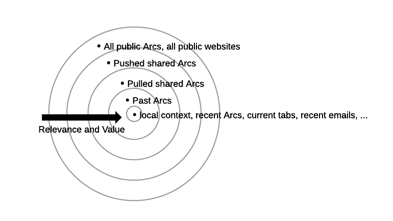
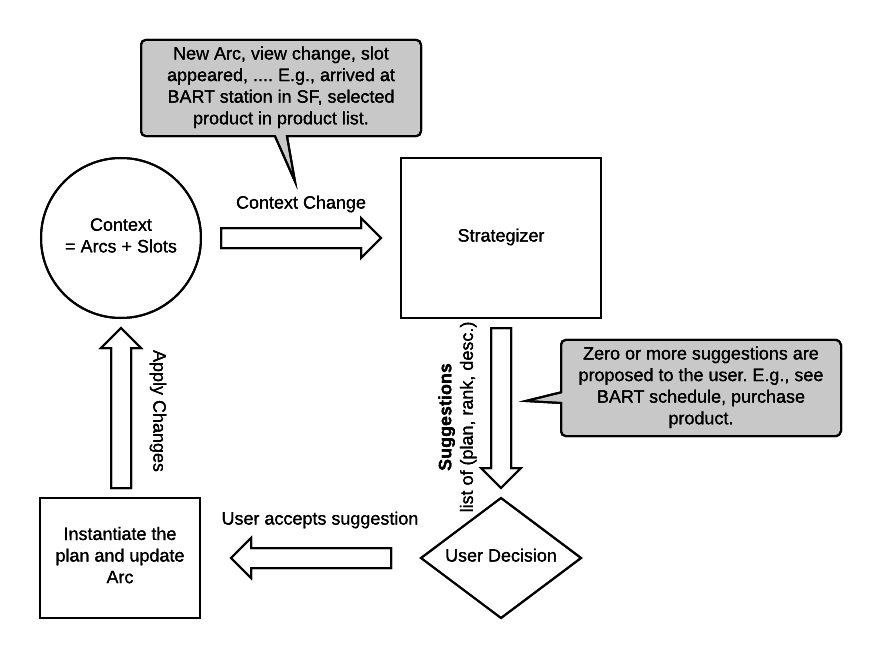

# Arcs Glossary

## **Arcs** 

Arcs is an [open source](https://github.com/PolymerLabs/arcs) project started by Google's Chrome team. The goal of the project is to create a open computing platform for the **assistive web** enabling delightful journeys for users.

## **Arc** 

An Arc is a concrete concept in Arcs that loosely maps to a user journey. E.g., "buying a birthday gift for my niece" or "eating out with my friends next week" could be journeys that would each get mapped to an Arc.

An Arc consists of

* One or more recipes that run inside the Arc. Recipes are authored by developers or composed by the strategizer with user input.
* Views that are owned by the Arc or were mapped into the Arc (from another Arc). Views correspond to data that may be read-only or writable by particles running inside the Arc.
* Zero or more suggested follow-on recipes. E.g., a restaurant may expose an Arc with a few follow-on recipes to book a table or order takeout.

An Arc can be

*   Persisted and recalled in the future when it becomes relevant again.
*   Serialized and run on multiple devices.
*   Private to a single user.
*   Publicly shared by a user, a website or an entity.
*   Shared amongst multiple Arcs identities.

## **Context** 

Set of all slots and Arcs (and their Views) that are available to the Arcs runtime and more specifically to the Strategizer for composing new user journeys. At the extreme outset, the context contains the set of all websites that exist on the web. More locally, the context contains a user's current location, open tabs, today's calendar entries, browsing history, …

Changes to the context can trigger existing Arcs and recipes to run and propose suggestions to the user. Context changes may also trigger the strategizer to propose new recipes and Arcs.

Conceptually, the Arcs context is split into different spheres of context. The center sphere holds the most relevant data this is most useful to Arcs for generating assistive suggestions. This data could be quite small and fit onto a single device. The outermost sphere contains all public Arcs. That sphere is enormous and requires large scale indexing and searching to be accessible and useful.

<!----- https://www.lucidchart.com/documents/edit/7aa37c46-b7d5-460e-a0e7-12ddb1d6d909/0?callback=close&name=docs&callback_type=back&v=969&s=612 ----->

## **Isolation** 

Each particle runs in an isolated execution environment that restricts the particle to only have side effects through very narrow interfaces: by rendering sanitized DOM through UX slots and through views.

In the Browser environment isolation is guaranteed by running particles in Web Workers that communicate to the Arcs runtime via serialized message passing.

## **Particle** 

A particle is the basic unit of computation in Arcs. A particle consists of a bit of JavaScript and UX code and is accompanied by a manifest.

The manifest describes the particle's input and output views which corresponds to the data the particle operates on. Views are singleton entities or sets of typed entities whose types are specified in manifest files.

The manifest also describes the ways in which the particle interacts with the user through UX slots. A particle may occupy UX slots which essentially correspond to UI surfaces where the particle is allowed to render content into (e.g., snippets of HTML). A particle can also expose expose parts of the UI they occupy as new slots that other particles may render content into.

Particles run in isolation of each other, are stateless and ephemeral. A particle may only communicate with other particles or with the Arcs runtime through its input and output views. Users interact with particles through UX that particles render in UX slots.

## **Manifest** 

A manifest specifies recipes, particles and schemas.

A schema spec defines entity types that represent input and output views in particles.

A particle spec includes:

*   Particle name or verb acting on input and output views and rendering into and exposing UX slots.
*   Input and output views are singleton entities or sets of entities with a certain schema and represent the inputs and outputs of the particle.
*   Rendered slots are UX slots the particle renders content into.
*   Exposed slots are UX slots the particle exposes to other particles in the recipe.

A recipe spec includes:

*   A list of particles, views and how they should be composed, i.e., describing the data flow.
*   A human readable description that explains what the recipe does.

## **Plan** 

A plan is a fully specified recipe where all particle inputs and outputs are mapped to actual views from the context, where all slots are bound to real UX slots and where every particle in the recipe correspond to a concrete, fully specified particle.

In other words: a plan is a special type of a recipe that is fully specified and therefore can be instantiated and run in an Arc.

It is the job of the strategizer to convert higher-level recipes into concrete plans that can run.

## **Recipe** 

Recipes are authored by developers and describe a high-level assistive behavior. E.g., "planning a group dinner with friends" or "allow bar guests w/ AR headset to refill (i.e., re-order) their beer glass w/ their favourite brew" might be recipes.

A recipe is a list of particles that describes how data flows between particles to execute the assistive action. In other words, it describes how particles are stitched together with appropriate views and slots to be fulfilled and run. All elements in a recipe may be fully specified (in which case it's called a plan) or may be under specified. A developer may describe a recipe at a high-level without specifying exactly what particles need to be used at every stage of the recipe. Instead, the developer may describe abstract particles with certain input and output views that will be bound to one or more concrete particles by the Arcs strategizer at runtime.

## **Resolver** 

The resolver runs under the hood in Arcs as part of the strategizer. It's job is to find concrete particles for every abstract particle in an underspecified recipe. It also will find adequate adapters when views from the context aren't compatible with the views specified in a recipe.

## **Slot** 

A slot is a UI placeholder that particles may render content into. In practice it can be a 
 with an ID that is reserved and available for Arcs to render content. A slot may be filled with content by a recipe that is running as part of an Arc or may be empty in which case it's waiting to receive content from Arcs. An empty slot is invisible to the user and doesn't take up any UI real estate.

A recipe that renders content into a slot may decide to split that slot (or UI affordance) up into sub-slots that can be exposed for other recipes to render content into. I.e., a "parent" recipe can delegate what and how content should be rendered into its slot to other children recipes.

## **Speculator** 

The speculator runs under the hood in Arcs as part of the strategizer. It speculatively executes complete or partial recipes in order to find the most relevant recipes that successfully run and that should be suggested to the user.

## **Strategizer** 

The strategizer represents a lot of the guts of Arcs and is where the "magic" happens. The strategizer reacts to changes in the context (new Arc, view changes, removed slots, …) and generates assistive recipes that are suggested and shown to the user.

E.g., the strategizer notices that you're approaching a train station and knows you're likely traveling from San Francisco to Berkeley (given past Arcs at that time of day). The strategizer may evaluate dozens of possible recipes for you in the background and eventually come up with and display two suggestions: "display BART schedule to Berkeley" and "purchase BART ticket to Berkeley with Android Pay". Picking one of these suggestions will cause the plan and recipe to be updated in the current Arc and will spawn the particles.

The strategizer is an internal system to Arcs that is not something developers will directly interact with in the foreseeable future.

<!----- https://www.lucidchart.com/documents/edit/0b241636-0fe1-4417-a863-28d0a966a84e/0?callback=close&name=docs&callback_type=back&v=1593&s=612 ----->

The figure above illustrates the role of the strategizer in generating suggested plans to assist the user. At a high-level the strategizer does the following tasks:

*   **Identify recipes** that may be useful given the context.
*   **Resolve** underspecified parts of recipes by finding concrete slots, views and particles.
*   **Speculatively execute** *recipes* that look promising to further refine the recipe.
*   **Evaluate** and score the set of currently suggested recipes

These tasks are not run in sequence and run several times each during a strategizer execution. The goal of the strategizer is to output a ranked list of fully resolved recipes (i.e., plans) with human readable descriptions that can be prompted to the user.

## **User Journey** 

A user journey is a fuzzy concept that represents a user goal typically spanning user interactions with multiple sites and people potentially lasting a long time. E.g., planning, booking, living and sharing a vacation may be a user journey. If you return to the same vacation spot over and over again then multiple vacations may even map to a single user journey (i.e., the journey of going to Hawaii every winter for Christmas).

In Arcs this fuzzy concept of user journey is concretely represented by an Arc. An Arc is an approximation of a user journey.

## **View** 

A view represents the data associated with an Arc and is owned by the Arc. Views may contain private user data (e.g., a user's calendar) or public data (e.g., a static website). Views are singleton entities or sets of entities typed according to schemas defined by the developer. Views are the inputs and outputs of particles.

The term "view" comes from SQL views suggesting that the data actually is stored someplace else, possibly in a non-Arcs system,  and exposed in Arcs via views.
