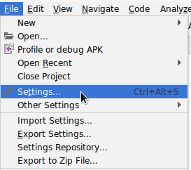
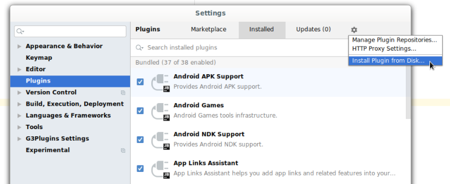

# Arcs IntelliJ Plugin

An IntelliJ plugin supporting Arcs manifests (*.arcs files).

## For Users

1) Either follow the _For Developers_ workflow below or run `./gradlew buildPlugin` in this directory.

2) Open up Settings panel in Intellij or Android Studio.

3) Select Plugin section, select "Install Plugin from Disk...".

4) Select `build/distributions/arcs_gradle_plugin-1.0.zip`.

## For Developers

1) Install IntelliJ

2) Install plugin: Grammar-Kit

3) From IntelliJ, import this directory as a Gradle Project.

4) Run Tools->Generate Parser Code on Arcs.bnf.

5) Run Tools->Run JFlex Generator on Arcs.flex.

6) Start developing with the instructions from https://www.jetbrains.org/intellij/sdk/docs/reference_guide/custom_language_support.html.

- Use :runIde to start another IntelliJ instance to test the plugin.
- Use :buildPlugin to build the shippable version of the plugin which will be
  located under build/distributions.
