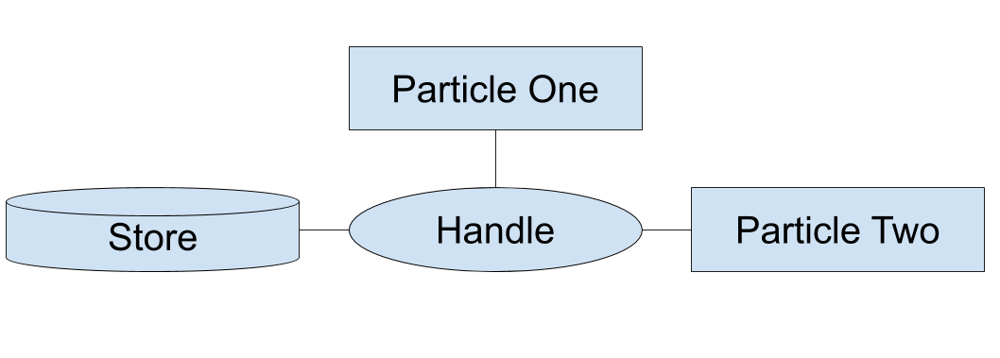

# Hello, World!

Welcome to developing using Arcs! By using Arcs as the platform for your system, you are choosing to value user sovereignty and leverage AI.  To get started, please obtain the project through [Github](https://github.com/PolymerLabs/arcs) using the instructions available there. For debugging purposes, we highly recommend having the [Arcs Explorer Chrome Extension](https://github.com/PolymerLabs/arcs/tree/master/devtools) also installed.

Before we get to code, it is important that we are all speaking the same language, so we present two definitions to start.

>- *Particle* - Modular component of functionality. Ideally small units so particles can be reusable. 
>- *Recipe* - A combination of particles to create features and systems.

Particles and recipes are defined using the Arcs Manifest Language and implemented in Javascript, Kotlin, or C++.  The best way to understand this is to jump into some code. Let’s look at how Hello World is implemented.

To start off with, we’re going to need two files, an Arcs manifest file (.arcs file) and a particle implementation in your language of choice. It’s easiest if we create a folder to house these files so we don’t lose them. As a matter of convention, particles live in the arcs/particles folder. Go ahead and create a new folder in there called ‘HelloWorld’.

Don’t worry if you don’t understand everything at the moment, we’ll be going over all of this in more detail throughout this tutorial. Let’s walk through these files line by line, starting with the .arcs file. You should create this file in your folder. By convention, .arcs files are camel case, so it should be called `HelloWorld.arcs` or something similar.
```
// The file begins by defining our particle. We can see the
// particle is implemented in HelloWorld.js, and therefore
// can assume it is a Javascript implementation.
particle HelloWorldParticle in 'HelloWorld.js'
  // Notice the tab that starts this line. Whitespace matters
  // in the Arcs manifest language, so this is very important.
  // Don't worry about what this line does at the moment, we'll
  // be getting to root and slots in more detail soon.
  root: consumes

// And now we are at the recipe definition!
recipe HelloWorldRecipe
  // Once again, notice the tab. This line tells us that the
  // HelloWorldRecipe contains a HelloWorldParticle.
  HelloWorldParticle
  // Finally, we provide a human readable description for the
  // recipe. This is optional, but will make it much easier and
  // nicer to debug. Once again, notice the tab.
  description `Tutorial 1: Hello World`
```

Alright, we’ve got our Arcs manifest file set. Now onto the Javascript. Just like the .arcs file, this should be in your HelloWorld folder. We set the file name in the .arcs file above to be `HelloWorld.js`.

```javascript
// To define a particle that interacts with the DOM, we use this boilerplate.
defineParticle(({SimpleParticle, html}) => {
 return class extends SimpleParticle {
   // Getter function which returns static HTML to display. In later tutorials 
   // we'll see how to use the templating functionality this provides.
   get template() {
     // You can use the html helper like so to render HTML:
     return html`<b>Hello, world!</b>`;
   }
 };
});
```

Once you have Arcs on your computer, run `tools/sigh devServer` in command line, then navigate to [http://localhost:8786/shells/dev-shell/?m=https://$particles/HelloWorld/HelloWorld.arcs](http://localhost:8786/shells/dev-shell/?m=https://$particles/HelloWorld/HelloWorld.arcs)

And that’s it! Congratulations, you have written your first program in Arcs!

# Template Interpolation Exploration

Alright, you’ve made your first Arcs program. But now it’s time to go make something! We are going to need a few more Arcs features to create anything of substance.

To get started, we want a way to make our UI dynamic. Simply returning static HTML is fairly boring. As with our Hello World program, we use `get template()` to return our base set of HTML, however we want to be able to update this in some way. To do so, we use the `render()` method and template interpolation. To make certain we are all speaking the same language, let’s define template interpolation within Arcs:

> *Template Interpolation* - A mechanism to substitute formatted data into renderable elements.

This interpolation occurs when `render()` returns a dictionary with keys that match elements in the template. The best way to explain how this works is to see it in action. The Arcs manifest file looks pretty much the same as with our Hello World example.

```
particle BasicTemplateParticle in 'BasicTemplate.js.js'
  root: consumes

recipe BasicTemplateRecipe
  BasicTemplateParticle
  description `Javascript Tutorial 2: Basic Templates`
```

Meanwhile, the Javascript looks quite different, as this is where the magic occurs:
```javascript
defineParticle(({SimpleParticle, html}) => {  
 return class extends SimpleParticle {
   get template() {
     // You can set placeholders in your template like so: {{name}}. The render
     // function is where these placeholders are overridden.
     // NOTE: Each placeholder needs to be enclosed inside its own HTML element
     // (here, a <span>).
     return html`<b>Hello, <span>{{name}}</span>!</b>`;
   }

   render() {
     // Returns a dictionary, mapping from placeholder name to value.
     return {name: 'Human'};
   }
 };
});
```

Now your code should say “Hello, Human!”. You can update this by changing what `render()` returns. In upcoming tutorials, we will see how this can be updated based on user input.

# Slots: The root of the matter

But, as promised, let’s get to understanding root. We start with a definition:

> Slots - An element of the Arcs platform that allows particles to render on a user interface. 

As a matter of notation, we say that particles consume slots when they fill a slot, and provide slots when they make slots available to other particles. Particles can also delegate by providing and consuming a slot. Root is the base slot that Arcs provides for particles to use. 

This all is a bit theoretical, so let's get to an example. To show how particles can provide and consume slots, this time we will have two particles.

As usual, we start with the Arcs manifest file:
```
// The "parent" particle. It provides a slot for another particle to render within.
particle ParentParticle in 'parent.js'
  // This particle renders to the root slot ("consumes" it), and provides a slot
  // called "mySlot" in which another particle can render. The
  // child particle will be rendered inside a special div with the identifier
  // "mySlot", which this particle will need to provide in its HTML.
  root: consumes
    mySlot: provides

// The "child" particle. Instead of consuming "root" it consumes "mySlot"
particle ChildParticle in 'child.js'
  render: consumes


// Unlike previous recipes, this one includes two particles.
recipe RenderSlotsRecipe
  ParentParticle
    // The ParentParticle consumes root just like particles in previous examples.
    root: consumes
      // ParentParticle also provides mySlot. Note the additional tab over.
      // The name "slot" is the name the recipe uses for the slot, and is how
      // the recipe connects the parent's mySlot and the child's mySlot
      mySlot: provides childSlot
  ChildParticle
    // And the ChildParticle consumes the slot.
    render: consumes childSlot

  description `Javascript Tutorial 3: Render Slots`
```

Next, we implement the parent and child particles in Javascript. To do this, we will create a Javascript file for each particle as outlined in the Arcs manifest file. We start with the ParentParticle which provides the slot.
```javascript
defineParticle(({SimpleParticle, html}) => {
 return class extends SimpleParticle {
   get template() {
     // The parent particle needs to provide a div with slotid "mySlot".
     // This is where the child particle will be rendered.
     return html`
       <b>Hello:</b>
       <div slotid="mySlot"></div>
     `;
   }
 };
});
```

Finally, we create ChildParticle which looks nearly identical to the particles we created in our first tutorials.
```
defineParticle(({SimpleParticle, html}) => {
 return class extends SimpleParticle {
   get template() {
     return html`Child`;
   }
 };
});
```

And there you have it! The mystery of root solved, and a basic understanding of slots. Slots are a large part of the power of Arcs to hide user data, so we'll be using them a lot going forward. So don't worry if you don't fully understand them yet, there will plenty more examples to come!

# Getting a Grip on Handles 
So now we’ve seen how multiple particles can be used in a single recipe. But what if we wanted the particles in our recipe to pass data? Well, to achieve this we need to use a few new Arcs concepts, as always we start with some definitions:

>- *Schema* - Composition of data to create a new type.
>- *Entity* - Entities are units of data in Arcs. They are created, exchanged and modified as means of communication between particles.
>- *Handle* - Handles allow particles to read, write and listen for data updates.

Those were some dense definitions. Let’s take a step back and understand how these concepts work in harmony to create working systems.

Schemas are used to define the data type. Entities are data, defined by a schema (data type). We use handles to pass this data between particles. The interaction between the handle and particle can be read and/or write. But don’t worry about this for the moment, we’ll cover these relationships in more detail in upcoming tutorials. 

To make this all a bit more clear, consider this diagram. Throughout Arcs documentation and developer tools, you’ll find handles are represented as ovals and particles are rectangles.


Hopefully this is at least as clear as a cup of strong coffee. To help, let’s get to a practical example. To make it a little bit more fun, we’re going to have the user input their name and then say hello to them. 

As usual, we start with the Arcs Manifest file. Because we are going to be using a handle, we will need to define a schema and two particles as outlined below. 

```
// Define a schema that allows us to store a person's name 
schema Person
  name: Text

// The GetPerson particle allows the user to input their name, then writes
// the input to the Person handle.
// This particle also provides a slot to display a greeting to the person.
particle GetPerson in './source/GetPerson.js'
  person: writes Person
  root: consumes
    greetingSlot: provides

// The DisplayGreeting particle, takes the name passed through the Person
// handle, and displays a greeting.
particle DisplayGreeting in './source/DisplayGreeting.js'
  person: reads Person
  greetingSlot: consumes

recipe HandleRecipe
  GetPerson
    // Pass the output person to the handle recipePerson.
    person: writes recipePerson 
    root: consumes
      greetingSlot: provides greeting
  DisplayGreeting
    // Define the input person to be the handle recipePerson.
    person: reads recipePerson
    greetingSlot: consumes greeting
  description `Javascript Tutorial 4: Handles`
```

Before we get to the Javascript files, there are two new functions we need to explain. First there is the `update()` function which is similar to `render()` but doesn’t return anything for template interpolation. As a general convention, we put processing in `update()` and leave only items needed for template interpolation in `render()`.   

The other new function in this tutorial is `shouldRender()`. Arcs will only run the `render()` function when `shouldRender()` returns true. This will be needed in the display greeting particle as we only want to render a greeting when the person exists.

Now, let’s see all this in practice, starting with the GetPerson.js file:
```javascript
defineParticle(({SimpleParticle, html}) => {

  const template = html`
<input placeholder="Enter your name" spellcheck="false" on-change="onNameInputChange">
<div slotid="greetingSlot"></div>
  `;

  return class extends SimpleParticle {
    get template() {
      return template;
    }

    // Because we have some logic to implement, we use update instead of render. 
    update() {
      // To set the "person" handle, we call this.set, pass the handle name as a
      // string, and then a JSON representation of the updated information. In this
      // case we give person the default value of "Human" so we have a value to
      // work with in the DisplayGreeting particle. 
      this.set('person', {name: 'Human'});
    }

    onNameInputChange(e) {
      // Update the value of person when the human enters a value.
      this.set('person', {name: e.data.value});
    }
  };
});
```
And finally the DisplayGreeting.js particle:
```javascript
defineParticle(({SimpleParticle, html}) => {

  const template = html`Hello, <span>{{name}}</span>!`;

  return class extends SimpleParticle {
    get template() {
      return template;
    }

    // We need the person handle within shouldRender, so it has to be passed in.
    shouldRender({person}) {
      // Here we check that the person is defined.
      return person;
    }

    // Just like with shouldRender, we need access to person, so declare it needs to be passed in.
    render({person}) {
      // We want the name from person to be interpolated into the template.
      return {
        name: person.name,
      };
    }
  };
});
```

Phew, we made it. We made our first human-interactive recipe using handles. There were a lot of new concepts required to get there. If you don’t understand entities, schemas and handles, don’t overly stress as all of the following tutorials use these concepts, so you will have plenty more examples to contemplate.

# The Template Interpolation Revisitation
So it’s time for a small confession. We didn’t give the full picture of how handles work in the previous section. To understand the full picture, we need a new definition, and to update our definition of handles:

>- *Stores* - A store represents a data location
>- *Handles* - Handles are manifestations of stores inside an arc. They allow particles to read, write and listen for data updates.

In essence, a store is where the data physically exists. The handle lets different particles access this data. With this understanding, we can update the picture we introduced in the last tutorial to include the store.



In the last tutorial, we set the Person handle inside of the particles. Person was also a singleton, it represented a single instance of the Person schema. In this tutorial, we will instead define a collection with multiple instances of Person inside the Arcs Manifest file. While a collection can be thought of as a list, there are no guarantees about the order of elements within the collection.
Using some more sophisticated template interpolation, we can easily greet everyone in our collection. But that’s enough explanation, let’s get to some code!

We begin with the Arcs manifest file which includes the collection of `PersonDetails`.
```
schema PersonDetails
  name: Text
  age: Number

// This is essentially a JSON file defined inside the manifest.
resource PeopleData
  start
  [
    {"name": "Jill", "age": 70},
    {"name": "Jack", "age": 25},
    {"name": "Jen", "age": 50}
  ]

// This data store contains a collection of entities rather than a single
// entity, and is backed by the PeopleData resource defined above.
store PeopleToGreetStore of [PersonDetails] in PeopleData

particle CollectionParticle in 'collections.js'
  // The input is a collection of PersonDetails entities.
  inputData: reads [PersonDetails]
  root: consumes

recipe CollectionRecipe
  data: map PeopleToGreetStore

  CollectionParticle
    inputData: reads data

  description `Javascript Tutorial 5: Collections`
```

And the Javascript:
```
defineParticle(({SimpleParticle, html}) => {
  return class extends SimpleParticle {
    get template() {
      // This template defines a subtemplate called "person". By filling in the "people" placeholder with a special construction given below in
      // the render() method, we can apply the "person" template on every element in our input list (which here turns it into an <li> element).
      return html`
        Hello to everyone:
        <ul>{{people}}</ul>

        <template person>
          <!-- This template is given a model object. It can access the properties on that model via the usual placeholder syntax. -->
          <li>Hello <span>{{name}}</span>, age <span>{{age}}</span>!</li>
        </template>
      `;
    }

    shouldRender(props) {
      return props && props.inputData;
    }

    // inputData is a list of PersonDetails objects.
    render({inputData}) {
      return {
        // This will fill in the "people" placeholder in the template above. We construct an object with special properties named "$template"
        // and "models", which defines how to render each item in the list.
        people: {
          // $template gives the name of the template to use to render each element.
          $template: 'person',
          // Each model in this list will get passed into the person template. The template can access the properties in this model (here, name
          // and age) via placeholders.
          models: inputData.map(personDetails => ({name: personDetails.name, age: personDetails.age})),
        }
      };
    }
  };
});
```

When you execute this recipe, you should see everyone being greeted. If you add or remove an entity from the `PeopleData` store, the number of people greeted will change accordingly thanks to the template interpolation.

# The Lore of a JSON Store

Hopefully by now you are starting to see how the different components of Arcs work together to preserve user sovereignty as you develop. This is the final chapter in our introductory tutorials which are designed to introduce the base Arcs concepts. But don’t worry, this is not the end of our tutorials! From here you can continue to the next set of tutorials where you’ll build a tic-tac-toe game with interchangeable human and computer players.

Alright, let’s get to the actual tutorial! This time, instead of embedding the store's data directly inside
the Arcs Manifest file (as a `resource`), we're going to load it from a separate JSON file. Let’s start with the Arcs Manifest file:
```
// Defines a new Entity called PersonDetails, with two fields.
schema PersonDetails
  name: Text
  age: Number

// Creates a data store of type PersonDetails, named PersonToGreetStore. The data will be loaded from the file data.json.
store PersonToGreetStore of PersonDetails in 'data.json'

particle JsonStoreParticle in 'JsonStore.js'
  // This particle has an input parameter called inputData. We can use this parameter in the particle's JavaScript file.
  inputData: reads PersonDetails
  root: consumes

recipe JsonStoreRecipe
  // This line connects this recipe to the data store above. It also creates a local alias for it called "data", which is how we will refer to
  // it inside the scope of this recipe.
  PersonToGreetStore: map data

  JsonStoreParticle
    // Binds the PersonDetails stored in the data store to JsonStoreParticle's inputData parameter.
    inputData: reads data

  description `Javascript Tutorial 6: JSON Store`
```

Next, we have the JSON file, which according to the Arcs Manifest should be called data.json:
```json
[
    {
        "name": "Jack",
        "age": 7
    }
]
```

And finally, the Javascript:
```javascript
defineParticle(({SimpleParticle, html}) => {
  return class extends SimpleParticle {
    get template() {
      return html`Hello <span>{{name}}</span>, aged <span>{{age}}</span>!`;
    }

    shouldRender({inputData}) {
      return inputData;
    }

    render({inputData}) {
      return {name: inputData.name, age: inputData.age};
    }
  };
});
```


Before we finish, let’s go over all of the concepts we have introduced in these tutorials.

>- *Particle* - Modular component of functionality. Ideally small units so particles can be reusable. 
>- *Recipe* - A combination of particles to create features and systems.
>- *Template Interpolation* - A mechanism to substitute formatted data into renderable elements.
>- *Slots* - An element of the Arcs platform that allows particles to render on a user interface.
>- *Schema* - Composition of data to create a new type.
>- *Entity* - Entities are units of data in Arcs. They are created, exchanged and modified as means of communication between particles.
>- *Stores* - A store represents a data location
>- *Handles* - Handles are manifestations of stores inside an arc. They allow particles to read, write and listen for data updates.

To see how we combine these elements to create a functioning system, checkout the tic-tac-toe tutorial next!
