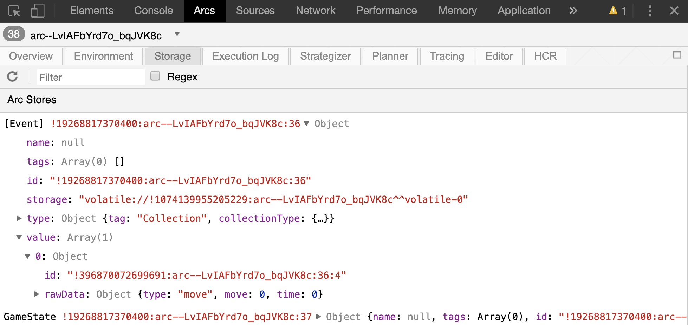

# Behold Tic Tac Toe

## Articles about Designing with Particles

So from our introductory tutorials, we have the following definition of a particle:

> *Particle* - Modular component of functionality. Ideally small units so particles can be reusable.

While that tells us _what_ a particle is, it does not say _how_ a particle should be used and _how_
a recipe should be divided into particles. To better understand how to design a system in Arcs, it
is important to have a full mental picture of particles. Just as there are multiple sides to any
person, particles have multiple faces. To fully understand them, we must look below the surface to
see the soul of particles.

#### Smallest Components
Even from the definition of particles, we know they should be small components. Just as with object
oriented programming, this lets us have easily interchangeable components. One can envision a world
where particles are made by external developers and combined to form recipes - much the way
developers use external libraries in object-oriented languages.

However, making particles as small as possible leads us towards a "turtles all the way down"
mentality. There is obvious overhead involved in each particle, therefore the desire for small
particles must be balanced against having too many.

#### Bounds of Data Knowledge
Arcs' mission statement says that users have sovereignty over their data and its use. To ensure
data only travels as intended, Arcs uses data flow analysis to make guarantees about data flow. But,
for this to work properly, particles must delineate knowledge boundaries. Just as each nation has a
border so customs and immigration can know where to operate, we need to create systems with well
defined boundaries so Arcs can know where data should (and more importantly, shouldn't) go.


#### Functional Components
When we create recipes, there are going to be occasions when it makes sense to extract some
functionality into its own particle. This is easiest to understand with an example, which we provide in
more detail below.

### Tic-Tac-Toe, here we go!

Alright, so let's get to putting this in practice with our tic-tac-toe game. As with any good
engineering project, we need a set of requirements. Here are ours:
 1. Play Tic Tac Toe with the traditional rules.
 2. Be able to have a human play against a computer.
 3. The players (human or computer) may make invalid moves at invalid times.
 4. Personal information, such as names, should be restricted to the components that need to know about them.
 5. The system should say who's turn it is.
 6. The system should congratulate the winner by name.
 7. The system should let you reset the game.

Based on these requirements, we can see right off the bat that we are going to need to have some
way to create a barrier since since the winner must be congratulated by name, but we want to restrict the
particles that know any personal information. To meet this requirement, we will devide the system into a
main game particle that can know personal information, and a board which cannot. We also know
we need a human and computer player. Thus, we start with these four particles.


Now you might be wondering how does this relate to the three ways of thinking about particles we
talked about above?


Ok, so now we've got 4 particles, but they currently have no way of communicating. Let's add some
handles to our system! To start off, we know the Board is going to need to communicate when things
have been clicked - be it a cell or the reset button. Let's call these Events. We know the Human
needs these events to determine their move. The Game will need it as well to enable resets.


Next, the Game needs a way of communicating the current state of things to everyone. This will
include things like what the board should look like and the current player.


At this point, the Human and Computer can see the current state of the game, but they have no way to
change it.  We need them to be able to pass moves to the game!


And finally, we need a way to hold information about the players.


Phew, there we have it. Now let's think about to our requirements. We had one that said the main UI
could not be trusted with any personal information. The personal information is held in PlayerOne and
PlayerTwo, and our main UI is the Board. Have we protected this data? Well, by looking at the diagram
with the untrusted particle highlighted, we can see the handles with personal data do not directly
connect to the Board. So the data should be safe.


## Designing the Best Manifest

Alright, so now we've got the basic design for our system, it's
time to go put it all together! Let's start by writing our Arcs
Manifest file. To do this, we know the particles and handles,
and how they fit together. But we don't know what the entities
the handles point to look like.

By looking at our diagram again, it becomes obvious we need four
schemas: Person, GameState, Event, and Move. These different types
are colored in the graph below to show where schemas are reused.


For now, let's not worry about what fields each of these schemas
has. This will become apparent as we start implementing the
system.

To start with, let's create the Board and the Game.  To do this,
we will also need to implement at least basic versions of the
GameState and Event handles. The Board needs to know what it
should display, thus GameState must include a representation of
the board. Meanwhile, the Board needs to provide the type of
move (it could be a reset or an actual move) and the move.
Because collections are not ordered, we also need some sort of
time so we can sort the Events and ensure only the most recent
Event is processed. In total, this gives us the following Schemas.

```
schema GameState
  board: Text

schema Event
  type: Text
  move: Number
  time: Number
```

Next comes the particles. Based on our diagram, we know the basic
flow of data. However, the diagram is slightly misleading. In Arcs,
if a handle is only listed as a "writes", then the particle cannot
read it. As a result, some of our outputs also need to be inputs
so we can store our own state. Taking this into account, we get the
following particles:

```
particle TTTBoard in 'TTTBoard.wasm'
  events: writes [Event]
  gameState: reads GameState
  boardSlot: consumes

particle TTTGame in 'TTTGame.wasm'
  gameState: reads writes GameState
  events: reads writes [Event]
  root: consumes
    boardSlot: provides
```

And finally, we need to put it together in the recipe:

```
recipe GamePlayersDemoRecipe
  TTTGame
    gameState: reads writes gameState
    events: reads writes events
    root: consumes
      boardSlot: provides board
  TTTBoard
    gameState: reads gameState
    events: writes events
    boardSlot: consumes board
  description `Kotlin Tutorial TicTacToe Demo`

```

Putting these three components together, we have the start of our
Tic-Tac-Toe game! Next up, we'll implement the Board particle.

## DevTools Rule

Before we can get to the Board, we need a very basic implementation
of the Game as this is what provides the slot for the Board. This
is shown below:

```kotlin
package arcs.tutorials.tictactoe

import arcs.sdk.Handle

class TTTGame : AbstractTTTGame() {
    private val defaultGame = TTTGame_GameState(board = ",,,,,,,,")

    override fun onHandleSync(handle: Handle, allSynced: Boolean) {
        if (handles.gameState.fetch() == null) {
            handles.gameState.set(defaultGame)
        }
    }

    override fun getTemplate(slotName: String): String = """
        <div slotid="boardSlot"></div>
        """.trimIndent()
}
```

Next, we implement the Game. This is explained in more detail
in the comments.
```kotlin
package arcs.tutorials.tictactoe

import arcs.sdk.Handle

class TTTBoard : AbstractTTTBoard() {

    private val defaultGameState = TTTBoard_GameState(
        board = ",,,,,,,,"
    )

    private val defaultEvent = TTTBoard_Events(
        type = "",
        move = -1.0,
        time = -1.0
    )

    private var clicks = 0.0
    private val emptyBoard = listOf("", "", "", "", "", "", "", "", "")

    init {
        eventHandler("onClick") { eventData ->
            handles.events.store(TTTBoard_Events(
                    type = "move",
                    move = eventData["value"]?.toDouble() ?: -1.0,
                    time = clicks
            ))
            clicks++
        }

        eventHandler("reset") {
            handles.events.store(TTTBoard_Events(type = "reset", time = clicks, move = -1.0))
            clicks++
        }
    }

    override fun onHandleUpdate(handle: Handle) = renderOutput()

    override fun populateModel(slotName: String, model: Map<String, Any>): Map<String, Any> {
        val gs = handles.gameState.fetch() ?: defaultGameState
        val boardList = gs.board.split(",")
        val boardModel = mutableListOf<Map<String, String?>>()
        boardList.forEachIndexed { index, cell ->
            boardModel.add(mapOf("cell" to cell, "value" to index.toString()))
        }

        return mapOf(
            "buttons" to mapOf(
                "\$template" to "button",
                "models" to boardModel
            )
        )
    }

    override fun getTemplate(slotName: String): String = """
            <style>
              .grid-container {
                display: grid;
                grid-template-columns: 50px 50px 50px;
                grid-column-gap: 0px;
              }

              .valid-butt {
                border: 1px outset blue;
                height: 50px;
                width: 50px;
                cursor: pointer;
                background-color: lightblue;
              }

              .valid-butt:hover {
                background-color: blue;
                color: white;
              }
            </style>
            <div class="grid-container">{{buttons}}</div>
            <template button>
              <button class="valid-butt" type="button" on-click="onClick" value="{{value}}" \>
                <span>{{cell}}</span>
              </button>
            </template>
            Please hit reset to start a new game.<button on-click="reset">Reset</button>
        """.trimIndent()
}
```

And finally, to build it all we need the BUILD file:
```BUILD
load(
    "//third_party/java/arcs/build_defs:build_defs.bzl",
    "arcs_kt_particles",
    "arcs_kt_schema",
)

arcs_kt_schema(
    name = "game_schemas",
    srcs = ["TTTGame.arcs"],
)

arcs_kt_particles(
    name = "particles",
    srcs = glob("*.kt"),
    deps = [":game_schemas"],
)
```

Alright, go ahead and pat yourself on the back. We are well on our
way to having Tic-Tac-Toe working. I know it doesn't seem that way
but don't worry, you're further along than you think. I know you
probably don't believe this, and your probably would like to see
something working. But how can we do this?

This is where the DevTools are your new best friend. Go ahead and
load your recipe in the Web Shell and then open the DevTools in
Chrome, make sure you've gone to the Arcs tab, and selected the
correct recipe.


We can see here our particles are correct connected using the
handles we specified in the recipe. This is cool, but in our case
not particularly useful. Now, navigate to the Storage tab.


Here we can see the two handles. Now, click on one of the cells in
your Tic Tac Toe board. The Events handle should flash yellow when
you click on the board as the handle is being updated.


Now if you click on Events, then values, then object you can see
the value of the event! In our case, we clicked on the first cell
which you can see because the move has a value of 0.



You can also click reset, and see this update in Events. In this
case, we can also see that the `time` is also updating properly.


Ta-da! We've managed to successfully create the Tic Tac Toe board,
and using the DevTools can see our handles update accordingly.

Next, we'll implement our players so you can actually play the
game!

## Creating the Human Player Layer

Currently you should have a tic-tac-toe board that does nothing.
Sure, you can click it and see the Events populate, but that is
still rather boring. Let's make it more fun by adding a human
player. By now, that original design we made in the first section
is probably not in the forefront of your mind, so we'll start by
looking at our design diagram.


From this, we can see that the Human Player needs a Player and
Move handle, and these handles connect the Game and Human Player.
We also need to populate the information about the player, so
we create a store. You can examine TTTGame.arcs in the src directory
to see this in action.

Next, we create the human player to take the events stream and
convert it to a move. This can be viewed in TTTHumanPlayer.kt
in the src directory.

Next, we need to update the game particle to update the board
based on the move. To do this, we start by adding an init function
and an applyMove function to TTTGame.kt:
```kotlin
init {
    handles.playerOneMove.onUpdate() { move ->
        applyMove(
            move ?: TTTGame_PlayerOneMove(),
            handles.playerOne.fetch() ?: TTTGame_PlayerOne()
        )
    }
}
private fun applyMove(move: TTTGame_PlayerOneMove, player: TTTGame_PlayerOne) {
    val mv = move.move.toInt()
    val gs = handles.gameState.fetch() ?: TTTGame_GameState()

    // Check if move is valid
    val boardList = gs.board.split(",").toMutableList()
    if (!mv.isValidMove(boardList) || gs.gameOver) return

    // Apply the move
    boardList[mv] = player.avatar

    handles.gameState.set(gs.copy(board = boardList.joinToString(",")))
    renderOutput()
}
```

And finally, as always, we need to add the HumanPlayer to the BUILD file.

By building and running this, when you click on a cell it should
be populate with the avatar set in the resource. By using this
sample code, this is an "X".

Next up, adding the computer player!

## Execute with Random Compute
So you can click around the board. While this is cool because it
means we're on our way to being able to play the game, it is
rather boring. It also makes it far too easy to win. So let's
create a computer to play against!

To do this, we need the game to understand that there are two
players, and they need to alternate turns. As a result we need
to add a currentPlayer field to gameState. Because we want to
handle personal player information, such as the name, with care,
we will make this an id integer. This in turn means we need to
update Person to include an id.

In addition, we need to add a random computer particle, along
with the associated additional handles for a second player.
All of these changes can be viewed here in the Arcs manifest
file in the src directory.

We also need the game to verify that moves are only accepted from
the current player and that each player only attempts to move
when it is their turn. This implementation can be seen in the
updated. To do this, we update the `if` statement in our
`applyMove` function in TTTGame:
```kotlin
if (!mv.isValidMove(boardList) || gs.currentPlayer != player.id || gs.gameOver) return
```

And now we can get to the whole point of this tutorial, the
random computer! Within this particle, we need to find the
empty cells on the board, and then pick one of them at
random. While this may not be the most exciting computer to
play against, it is sufficient to see how Arcs works. The
code for the random computer particle can be seen in
TTTRandomComputer.kt in the src directory.

## Exclusivity to Avoid Infinity
Alright, now we've got our game setup, and you can play it, but it isn't quite meeting all our
requirements. Let's take a look to see how we're doing:

 [X] 1. Play Tic Tac Toe with the traditional rules.
 [X] 2. Be able to have a human play against a computer.
 [] 3. The players (human or computer) may make invalid moves at invalid times.
 [X] 4. Personal information, such as names, should be restricted to the components that need to know about them.
 [] 5. The system should say who's turn it is.
 [] 6. The system should congratulate the winner by name.
 [] 7. The system should let you reset the game.

Three requirements down, only four to go! While this may sound like a lot, we've set ourselves up
to make them really easy to tackle.

Before we get to the code, it's important we remember that particles are reactive in nature.
Game should update GameState. However, we must be careful to not update GameState when the
GameState handle is updated. Otherwise, we can easily create an infinite loop. 

With this in mind, let's get to the code. We update the template and create a model
to inform users who is the current player. To congratulate the winner by name, we first have to know
someone has won. We do this by creating an array that represents all the combinations a player can
win by, then check if any player has claimed all those cells. If so, we congratulate them by using
the template and model.

And finally, we need to reset the game. When the Game sees a "reset" event, it simply sets gameState
back to the original condition and resets the player's moves. You can see the completed TTTGame code
in the TTTGame.kt file in the src directory.

And, that's it, we've met all of our requirements! But wait, just like every great info-mercial,
there's more! Checkout the next (and final) tutorial to see how Arcs lets us combine these particles
to create 2 more variations of tic-tac-toe without writing another line of Kotlin code.

## Extensibility via a Recipe

By now you're probably thinking what could we possibly have left to cover? After all, in the last
tutorial we finished our tic-tac-toe game, and even checked it against the requirements! Well,
while this is true, there is one very nifty feature of Arcs that we haven't had a chance to show
off yet. And, well, this being written by an Arcs engineers, we'd like to show off just a little.

So we've created a tic-tac-toe game where a human can play against a computer. But what if the user
instead wanted to play against one of their friends? Or what if they wanted to watch two computer's
play? Because of the extensibility of the system, we can simply create new recipes with the existing
particles to create these systems.

We just change whether a `TTTHumanPlayer` particle or a
`TTTRandomComputer` particle is updating the associated `move` handle.  This means we can create
these two variants of tic-tac-toe without writing another line of Kotlin code!  You can see all of
this in the Arcs Manifest file in the src directory.

Upon closer inspection of this file, you'll also note we changed the "X"s and "O"s to be emojis.
This is because Arcs supports Unicode and, once again, we wanted a chance to show off just a little.

And there you have it! Three fully functional tic-tac-toe games. By now you should feel comfortable
working with particles and handles and combining them to form recipes. These recipes allow you as a
developer to maintain user sovereignty from design through to implementation.
