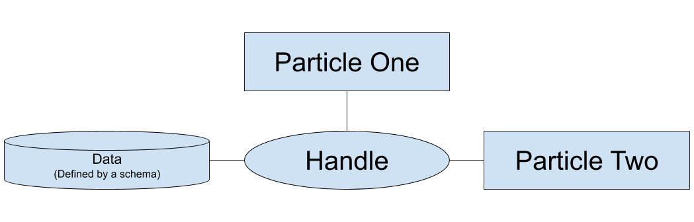
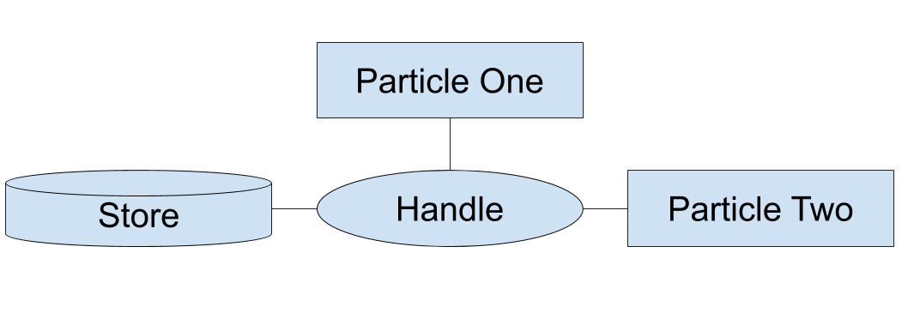

# Hello, World!
Welcome to developing using Arcs! By using Arcs as the platform for your system, you are choosing to value user sovereignty and leverage AI.  To get started, please obtain the project through [Github](https://github.com/PolymerLabs/arcs) using the instructions available there. For debugging purposes, we highly recommend having the [Arcs Explorer Chrome Extension](https://github.com/PolymerLabs/arcs/tree/master/devtools) also installed.

Before we get to code, it is important that we are all speaking the same language, so we present two definitions to start.

>- *Particle* - Modular component of functionality. Ideally small units so particles can be reusable.
>- *Recipe* - A combination of particles to create features and systems.

Particles and recipes are defined using the Arcs Manifest Language and implemented in Javascript, Kotlin, or C++.  The best way to understand this is to jump into some code. Let’s look at how Hello World is implemented.

To start off with, we’re going to need two files, an Arcs manifest file (.arcs file) and a particle implementation in your language of choice. It’s easiest if we create a folder to house these files so we don’t lose them. As a matter of convention, particles live in the arcs/particles folder. Go ahead and create a new folder in there called ‘HelloWorld’.

Don’t worry if you don’t understand everything at the moment, we’ll be going over all of this in more detail throughout this tutorial. Let’s walk through these files line by line, starting with the .arcs file. You should create this file in your folder. By convention, .arcs files are title case, so it should be called `HelloWorld.arcs` or something similar.
```
// The file begins by defining our particle. Based on the file
// path, We can assume the particle is implemented in kotlin.
particle HelloWorld in 'HelloWorld.wasm'
  // Notice the tab that starts this line. Whitespace matters
  // in the Arcs manifest language, so this is very important.
  // Don't worry about what this line does at the moment, we'll
  // be getting to root and slots in more detail soon.
  root: consumes

// And now we are at the recipe definition!
recipe HelloWorldRecipe
  // Once again, notice the tab. This line tells us that the
  // HelloWorldRecipe contains a HelloWorld.
  HelloWorld
  // Finally, we provide a human readable description for the
  // recipe. This is optional, but will make it much easier and
  // nicer to debug. Once again, notice the tab.
  description `Tutorial 1: Hello World`
```

Alright, we’ve got our Arcs manifest file set. Now onto the Kotlin. Just like the .arcs file, this should be in your HelloWorld folder. We set the file name in the .arcs file above to be `HelloWorld.kt`.

```kotlin
package arcs.tutorials

// We define the HelloWorld class to be a child
// of the AbstractHelloWorld class, which was autogenerated for us.
class HelloWorld : AbstractHelloWorld() {
    // Set the template to be "Hello, world!" as this is what we want
    // to display.
    override fun getTemplate(slotName: String) = "<b>Hello, world!</b>"
}
```

Finally, we need a 'BUILD' file. Arcs particles can be built using Bazel rules. Here's an example Bazel BUILD file for HelloWorld:

```BUILD
# Required imports
load("//build_defs:build_defs.bzl", "arcs_kt_particles")

# Arcs Kotlin particle build rule
arcs_kt_particles(
    name = "HelloWorld",
    srcs = ["HelloWorld.kt"],
)
```
run the build file by running `./tools/bazelisk build particles/HelloWorld:all` from the root arcs folder.

Once you have Arcs on your computer, run `tools/sigh devServer` in command line, then navigate to [http://localhost:8786/shells/dev-shell/?m=https://$particles/HelloWorld/HelloWorld.arcs](http://localhost:8786/shells/dev-shell/?m=https://$particles/HelloWorld/HelloWorld.arcs)

And that’s it! Congratulations, you have written your first program in Arcs!

# Template Interpolation Exploration

Alright, you’ve made your first Arcs program. But now it’s time to go make something! We are going to need a few more Arcs features to create anything of substance.

To get started, we want a way to make our UI dynamic. Simply returning static HTML is fairly boring. As with our Hello World program, we use `getTemplate()` to return our base set of HTML, however we want to be able to update this in some way. To do so, we use the `populateModel()` method and template interpolation. To make certain we are all speaking the same language, let’s define template interpolation within Arcs:

> *Template Interpolation* - A mechanism to substitute formatted data into renderable elements.

This interpolation occurs when `populateModel()` returns a dictionary with keys that match elements in the template. The best way to explain how this works is to see it in action. The Arcs manifest file looks pretty much the same as with our Hello World example.

```
particle BasicTemplate in 'BasicTemplate.wasm'
  root: consumes

recipe BasicTemplateRecipe
  BasicTemplate
  description `Kotlin Tutorial 2: Basic Templates`
```

Meanwhile, the Kotlin looks quite different, as this is where the magic occurs:
```kotlin
package arcs.tutorials

class BasicTemplate : AbstractBasicTemplate() {
    // Returns a map that goes from placeholder name to value.
    override fun populateModel(slotName: String, model: Map<String, String>): Map<String, String> {
        return model + mapOf(
            "name" to "Human"
        )
    }

     // You can set placeholders in your template like so: {{name}}. The render
     // function is where these placeholders are overridden.
     // NOTE: Each placeholder needs to be enclosed inside its own HTML element
     // (here, a <span>).
    override fun getTemplate(slotName: String) = "<b>Hello, <span>{{name}}</span>!</b>"
}
```

Finally, the Bazel BUILD file, which looks nearly identical to the one we used in the hello world program.
```
load("//build_defs:build_defs.bzl", "arcs_kt_particles")

arcs_kt_particles(
    name = "BasicTemplate",
    srcs = ["BasicTemplate.kt"],
)
```

Now your code should say “Hello, Human!”. You can update this by changing what `populateModel()` returns. In upcoming tutorials, we will see how this can be updated based on user input.

# Slots: The root of the matter

But, as promised, let’s get to understanding root. We start with a definition:

> Slots - an element of the Arcs platform that allows particles to render on a user interface.

As a matter of notation, we say that particles consume slots when they fill a slot, and provide slots when they make slots available to other particles. Particles can also delegate by providing and consuming a slot. Root is the base slot that Arcs provides for particles to use.

This all is a bit theoretical, so let's get to an example. To show how particles can provide and consume slots, this time we will have two particles.

As usual, we start with the Arcs manifest file:
```
// The "parent" particle. It provides a slot for another particle to be rendered inside it.
particle ParentParticle in 'particles.wasm'
  // This particle renders to the root slot ("consumes" it), and provides a slot inside it called
  // "mySlot" in which another particle can render itself. The child particle will be rendered inside
  // a special div with the identifier "mySlot", which this particle will need to provide in its HTML.
  root: consumes
    mySlot: provides

// The "child" particle. Instead of consuming "root" it consumes "mySlot", which connects it to the
// slot provided by ParentParticle.
particle ChildParticle in 'particles.wasm'
  render: consumes

recipe RenderSlotsRecipe
  ParentParticle
    root: consumes
      mySlot: provides childSlot
  ChildParticle
    render: consumes childSlot

  description `Kotlin Tutorial 3: Render Slots`

```

Next, we implement the parent and child particles in Kotlin. To do this, we will create a Kotlin file for each particle as outlined in the Arcs manifest file. We start with the ParentParticle which provides the slot.
```Kotlin
package arcs.tutorials

class ParentParticle : AbstractParentParticle() {
    // The parent particle needs to provide a div with slotid "mySlot".
    override fun getTemplate(slotName: String) = "<b>Hello:</b><div slotId=\"mySlot\"></div>"
}
```

The ChildParticle looks nearly identical to the particles we created in our first tutorials.
```Kotlin
package arcs.tutorials

class ChildParticle : AbstractChildParticle() {
    override fun getTemplate(slotName: String) = "Child"
}
```

And finally the BUILD file, which is the same as in the previous tutorials, but has a second rule.
```
load("//third_party/java/arcs/build_defs:build_defs.bzl", "arcs_kt_particles")

arcs_kt_particles(
    name = "particles",
    srcs = [
        "ParentParticle.kt",
        "ChildParticle.kt",
    ],
)
```

And there you have it! The mystery of root solved, and a basic understanding of slots. Slots are a large part of the power of Arcs to hide user data, so we'll be using them a lot going forward. So don't worry if you don't fully understand them yet, there will plenty more examples to come!

# Getting a Grip on Handles
So now we’ve seen how multiple particles can be used in a single recipe. But what if we wanted the particles in our recipe to pass data? Well, to achieve this we need to use a few new Arcs concepts, as always we start with some definitions:

>- *Schema* - Composition of data to create a new type.
>- *Entity* - Entities are units of data in Arcs. They are created, exchanged and modified as means of communication between particles.
>- *Handle* - Handles allow particles to read, write and listen for data updates.

Those were some dense definitions. Let’s take a step back and understand how these concepts work in harmony to create working systems.

Schemas are used to define the data type. Entities are data, defined by a schema (data type). We use handles to pass this data between particles. The interaction between the handle and particle can be read and/or write. But don’t worry about this for the moment, we’ll cover these relationships in more detail in upcoming tutorials.

To make this all a bit more clear, consider this diagram. Throughout Arcs documentation and developer tools, you’ll find handles are represented as ovals and particles are rectangles.



Hopefully this is at least as clear as a cup of strong coffee. To help, let’s get to a practical example. To make it a little bit more fun, we’re going to have the user input their name and then say hello to them.

This time, we will create a separate Arcs Manifest file for our schema. Let's call it `PeopleSchemas.arcs`. We do this, because we may want to reuse the same schemas across multiple Manifest files. We also may add more schemas later on.

```
// Define a schema that allows us to store a person's name
schema Person
  name: Text
```

Next, we create our primary Arcs Manifest file. Because we are going to be using a handle, we will need to import the above schema and define two particles, as outlined below.

```
// Imports contents of another manifest via a relative path from this manifest.
import 'PeopleSchemas.arcs'

// The GetPerson particle allows the user to input their name, then writes
// the input to the Person handle.
// This particle also provides a slot to display a greeting to the person.
particle GetPerson in 'particles.wasm'
  person: writes Person
  root: consumes
    greetingSlot: provides

// The DisplayGreeting particle, takes the name passed through the Person
// handle, and displays a greeting.
particle DisplayGreeting in 'particles.wasm'
  person: reads Person
  greetingSlot: consumes

recipe HandleRecipe
  GetPerson
    // Pass the output person to the handle recipePerson.
    person: writes recipePerson
    root: consumes
      greetingSlot: provides greeting
  DisplayGreeting
    // Define the input person to be the handle recipePerson.
    person: reads recipePerson
    greetingSlot: consumes greeting
  description `Kotlin Tutorial 4: Handles`
```

Before we get to the code, we need to understand a little bit more about how schemas, entities, and handles work under the hood in Kotlin-Wasm.
We know that an entity is defined by a schema, just as an object is defined by its class. In Kotlin, we take advantage of
this analogy by implementing schemas as classes and entities as object instantiations.
So now we have a way to represent the data, but we need to connect everything. Luckily we have handle classes to do this!
These classes are generated by our Bazel rules according to the specification of the manifest file. We can access handles anywhere in our particle, provided that we inherit the right abstract class.
Let's look at how easy it is to use handles in a particle!

```kotlin
package arcs.tutorials

// AbstractGetPersonParticle is autogenerated by the Bazel build rules. It
// includes a `person` Handle as a member variable.
class GetPersonParticle : AbstractGetPersonParticle() {
    override fun getTemplate(slotName: String) = """
        <input placeholder="Enter your name" spellcheck="false" on-change="onNameInputChange">
        <div slotid="greetingSlot"></div>
    """.trimIndent()

    init {
        // When the name is changed, we want to assign the new name to the person. So we register an event handler
        // on the element.
        eventHandler("onNameInputChange") { eventData ->
            // Get the current person (a handle) if it doesn't exist we get a new object.
            val p = person.fetch() ?: GetPerson_Person()
            // Set the name to be the newly entered value.
            p.name = eventData["value"] ?: "Human"
            // Update the handle based to be our new person.
            person.set(p)
        }
    }
}
```
Next we have the DisplayGreeting.kt particle:

```kotlin
package arcs.tutorials

import arcs.sdk.Handle

class DisplayGreetingParticle : AbstractDisplayGreetingParticle() {
    override fun getTemplate(slotName: String) = "Hello, <span>{{name}}</span>!"

    override fun onHandleUpdate(handle: Handle) {
        this.renderOutput()
    }

    override fun populateModel(slotName: String, model: Map<String, Any>): Map<String, Any> {
        return model + mapOf(
            "name" to (person.fetch()?.name ?: "Human")
        )
    }
}
```

And finally, the BUILD file. Note the `arcs_kt_schema` rule which will generate schemas of the form
'$ParticleName_EntityName'. This is why `DisplayGreeting.kt` referenced `GetPerson_Person()` while `DisplayGreeting.kt`
referenced `DisplayGreeting_Person()`.

On that note: since we put the Person schema in its own Arcs Manifest file, we need to include this in our BUILD rule. To do this, we define an arcs_manifest rule. This gives us the option to use these schemas in many particles and recipes down the line.

```build
load(
    "//third_party/java/arcs/build_defs:build_defs.bzl",
    "arcs_kt_particles",
    "arcs_kt_schema",
    "arcs_manifest",
)

# This rule defines the manifest (i.e. a set of `.arcs` files) that should be depended upon for 
# schema generation
arcs_manifest(
    name = "shared_people_schemas",
    srcs = ["PeopleSchemas.arcs"],
)

# Here, this rule generates Kotlin entities for a target manifest. Only schemas used in a particle 
# (or "particle connections") will generate entities.
arcs_kt_schema(
    name = "handles_schemas",
    srcs = ["Handles.arcs"],
    package = "arcs.tutorials",
    deps = [":shared_people_schemas"],
)

arcs_kt_particles(
    name = "particles",
    srcs = [
        "GetPerson.kt",
        "DisplayGreeting.kt",
    ],
    deps = [":handles_schemas"],
)
```

Phew, we made it. We made our first human-interactive recipe using handles. There were a lot of new concepts required
to get there. If you don’t understand entities, schemas and handles, don’t overly stress as all of the following tutorials
use these concepts, so you will have plenty more examples to contemplate.

# The Template Interpolation Revisitation
So it’s time for a small confession. We didn’t give the full picture of how handles work in the previous section.
To understand the full picture, we need a new definition, and to update our definition of handles:

>- *Stores* - A store represents a data location
>- *Handles* - Handles are manifestations of stores inside an arc. They allow particles to read, write and listen for data updates.

In essence, a store is where the data physically exists. The handle lets different particles access this data. With this understanding, we can update the picture we introduced in the last tutorial to include the store.



In the last tutorial, we set the Person handle inside of the particles. Person was also a singleton, it represented a single instance of the Person schema. In this tutorial, we will instead define a collection with multiple instances of Person inside the Arcs Manifest file. While a collection can be thought of as a list, there are no guarantees about the order of elements within the collection.
Using some more sophisticated template interpolation, we can easily greet everyone in our collection. But that’s enough explanation, let’s get to some code!

We begin by adding an additional schema to the `PeopleSchemas.arcs` manifest. 
```
schema Person
  name: Text
  
schema PersonDetails
  name: Text
  age: Number
  
```

Next, we create a new Arcs Manifest file called `Collections.arcs`. Here, we can define a way to greet a collection of people:

```
import 'PeopleSchemas.arcs'

// This is essentially a JSON file defined inside the manifest.
resource PeopleData
  start
  [
    {"name": "Jill", "age": 70},
    {"name": "Jack", "age": 25},
    {"name": "Jen", "age": 50}
  ]

// This data store contains a collection of entities rather than a single
// entity, and is backed by the PeopleData resource defined above.
store PeopleToGreetStore of [PersonDetails] in PeopleData

particle CollectionsParticle in 'Collections.wasm'
  // The input is a collection of PersonDetails entities.
  inputData: reads [PersonDetails]
  root: consumes

recipe CollectionRecipe
  data: map PeopleToGreetStore

  CollectionsParticle
    inputData: reads data

  description `Kotlin Tutorial 5: Collections`
```

And the Kotlin:
```kotlin
package arcs.tutorials

/**
 * Sample Kotlin-WASM Particle to use a JSON store.
 */
class CollectionsParticle : AbstractCollectionsParticle() {
    override fun populateModel(slotName: String, model: Map<String, Any>): Map<String, Any> {
        // We begin by generating the list of models that should fill the template. Our template
        // has name ang age so we will use these names.
        val peopleList = mutableListOf<Map<String, Comparable<*>?>>()
        people.forEach { people ->
            peopleList.add(mapOf("name" to people.name, "age" to people.age))
        }

        // This will fill in the "people" placeholder in the template above. We construct an object
        // with special properties named "$template" and "models", which defines how to render each
        // item in the list.
        return model + mapOf(
            "people" to mapOf(
                // $template gives the name of the template to use to render each element.
                "\$template" to "person",
                // Each model in this list will get passed into the person template. The template
                // can access the properties in this model (name and age) via placeholders.
                "models" to peopleList
            )
        )
    }

    override fun getTemplate(slotName: String): String {
        // This template defines a subtemplate called "person". By filling in the "people"
        // placeholder with a special construction given below in the render() method, we can
        // apply the "person" template on every element in our input list (which here turns it
        // into an <li> element).
        return """Hello to everyone:
        <ul>{{people}}</ul>

        <template person>
          <li>Hello <span>{{name}}</span>, age <span>{{age}}</span>!</li>
        </template>"""
    }
}
```

And the BUILD file:
```build
load(
    "//third_party/java/arcs/build_defs:build_defs.bzl",
    "arcs_kt_particles",
    "arcs_kt_schema",
    "arcs_manifest",  
)

arcs_manifest(
    name = "shared_people_schemas",
    srcs = ["PeopleSchemas.arcs"],
)

arcs_kt_schema(
    name = "collections_schemas",
    srcs = ["Collections.arcs"],
    deps = [":shared_people_schemas"]
)

arcs_kt_particles(
    name = "Collections",
    srcs = ["Collections.kt"],
    deps = [":collections_entities"],
)
```

When you execute this recipe, you should see everyone being greeted. If you add or remove an entity from the `PeopleData` store, the number of people greeted will change accordingly thanks to the template interpolation.

# The Lore of a JSON Store

Hopefully by now you are starting to see how the different components of Arcs work together to preserve user sovereignty as you develop. This is the final chapter in our introductory tutorials which are designed to introduce the base Arcs concepts. But don’t worry, this is not the end of our tutorials! From here you can continue to the next set of tutorials where you’ll build a tic-tac-toe game with interchangeable human and computer players.

Alright, let’s get to the actual tutorial! This time, instead of embedding the store's data directly inside
the Arcs Manifest file (as a `resource`), we're going to load it from a separate JSON file. Let’s start with the Arcs Manifest file:

```
 import 'PeopleSchemas.arcs'

 // Creates a data store of type PersonDetails, named PersonToGreetStore. The data will be loaded from the file data.json.
 store PersonToGreetStore of PersonDetails in 'data.json'

 particle JsonStoreParticle in 'JsonStore.wasm'
   // This particle has an input parameter called inputData. We can use this parameter in the particle's Kotlin file.
   inputData: reads PersonDetails
   root: consumes

 recipe JsonStoreRecipe
   // This line connects this recipe to the data store above. It also creates a local alias for it called "data", which is how we will refer to
   // it inside the scope of this recipe.
   data: map PersonToGreetStore

   JsonStoreParticle
     // Binds the PersonDetails stored in the data store to JsonStoreParticle's inputData parameter.
     inputData: reads data

   description `Kotlin Tutorial 6: JSON Store`
```

You'll notice we import the same PeopleSchemas.arcs file that we created in the last tutorial. This is the power of imported Arcs Manifest files, they let you reuse schema definitions rather than having to recreate them in each recipe. 

Next, we have the JSON file, which according to the Arcs Manifest should be called data.json:
```json
[
    {
        "name": "Jack",
        "age": 7
    }
]
```

And finally, the Kotlin which should look fairly familiar:
```kotlin
package arcs.tutorials

/**
 * Sample Kotlin-WASM Particle to use a JSON store.
 */
class JsonStoreParticle : AbstractJsonStoreParticle() {
    override fun populateModel(slotName: String, model: Map<String, Any>): Map<String, Any> {
        val person = res.fetch() ?: JsonStoreParticle_InputData()

        return model + mapOf(
            "name" to person.name,
            "age" to person.age
        )
    }

    override fun getTemplate(slotName: String): String {
        return "<b>Hello, <span>{{name}}</span>, aged <span>{{age}}</span>!</b>"
    }
}
```


Before we finish, let’s go over all of the concepts we have introduced in these tutorials.

>- *Particle* - Modular component of functionality. Ideally small units so particles can be reusable.
>- *Recipe* - A combination of particles to create features and systems.
>- *Template Interpolation* - A mechanism to substitute formatted data into renderable elements.
>- *Slots* - An element of the Arcs platform that allows particles to render on a user interface.
>- *Schema* - Composition of data to create a new type.
>- *Entity* - Entities are units of data in Arcs. They are created, exchanged and modified as means of communication between particles.
>- *Stores* - A store represents a data location
>- *Handles* - Handles are manifestations of stores inside an arc. They allow particles to read, write and listen for data updates.

To see how we combine these elements to create a functioning system, checkout the tic-tac-toe tutorial next!

