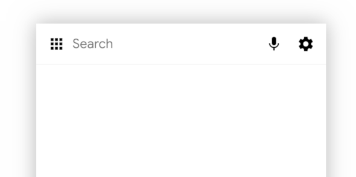
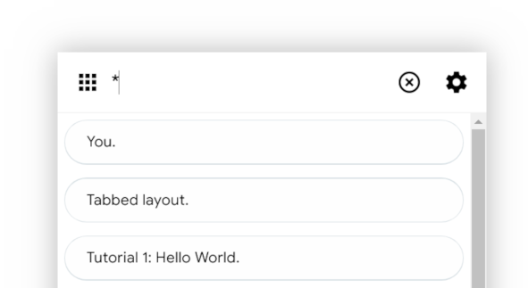
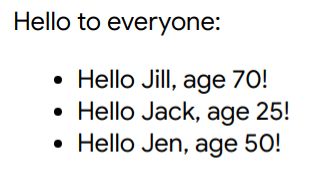

# Particle Tutorial

This is a tutorial for teaching you how to write particles. It's still a work-in-progress.

Other resources to check out are [manifest.md](../../src/runtime/manifest.md), which gives a terse summary of all the features and syntax of
manifest files, and the [Arcs Developer Documentation guide](https://docs.google.com/document/d/1F6Q4u_VbXGlfYUm0y_OSNJOe9nIeSCnrRMZnls8Hkvg),
which has a similar tutorial, but at time of writing is out of date.

The tutorials are all defined in [Tutorial.arcs](Tutorial.arcs). I'd recommend going through them in order, since each one builds on the
ones that come before.

## Running the tutorials

Edit the [canonical.arcs file](../canonical.arcs) and uncomment the line that says:

```
import 'Tutorial/Tutorial.arcs'
```

Then run:

```
npm start
```

Open the Arcs shell at http://localhost:8786/shells/web-shell/?user=xyz. You'll notice a small subtle rectangle at the bottom of the screen:


If you hover over that with your mouse it will expand to a search box:



You can double click on the search box to search for all recipes (it will change to show an asterisk):



Alternatively you can type in the box to filter search results (e.g. try searching for "tutorial", you should see a list of tutorial recipes
appear).

## Debugging tips

When you're writing your own particles, a whole lot of things can go wrong. Here's a list of things to try:

* `./tools/sigh test` will run all unit tests, including a test called "Particle definitions" that checks that all schemas get parsed correctly.
  You can use `-g` to filter the tests that get run, e.g. `./tools/sigh test -g Tutorial` will test all the tutorial recipes. Run this to check
  for syntax errors after editing a recipe.
* Open up the Chrome developer console and look for errors (keep it open).
* Make sure your file is being imported in `canonical.arcs`.
* If you edit a recipe/manifest file, reload the Arcs shell. If you had a running Arc and have edited your recipe, you'll need to strip the
  argument that looks like `&arc=z--LanLorQ75nIUb8NlWWD` from the URL before reloading. This will force the runtime to recompute your recipe's
  dependencies.
* You may also need to delete the colourful box for the running Arc from the shell, and search for it and run it again.
* If you're only editing your JavaScript, it should be safe to just reload the page of the running Arc.
* Sometimes users can get a bit borked. Try changing to another user and see if that helps: `?user=abc`.
* Install the [Arcs Chrome Extension](../../extension/README.md), and look at the Strategizer tab to see if there's any reasons given for why
  your recipe couldn't be resolved. It helps to filter for your recipe name.

## Tutorial 1: Hello World

This tutorial creates a recipe containing a single particle, that just says "Hello, world!". Once you run the tutorial you should see this in
the top left of the screen:


Implement it in Javascript at [particles/Tutorial/Javascript/1_HelloWorld](https://github.com/PolymerLabs/arcs/tree/master/particles/Tutorial/Javascript#hello-world) or in Kotlin at [particles/Tutorial/Kotlin/1_HelloWorld](https://github.com/PolymerLabs/arcs/tree/master/particles/Tutorial/Kotlin#hello-world)

## Tutorial 2: Template Interpolation Exploration

This tutorial demonstrates how to render data in a template.


Implement it in Javascript at [particles/Tutorial/Javascript/2_BasicTemplates](https://github.com/PolymerLabs/arcs/tree/master/particles/Tutorial/Javascript#template-interpolation-exploration) or in Kotlin at [particles/Tutorial/Kotlin/2_BasicTemplates](https://github.com/PolymerLabs/arcs/tree/master/particles/Tutorial/Kotlin#template-interpolation-exploration)

## Tutorial 3: Slots: start with root

This tutorial combines two particles using render slots.


Implement it in Javascript at [particles/Tutorial/Javascript/3_RenderSlots](https://github.com/PolymerLabs/arcs/tree/master/particles/Tutorial/Javascript#slots-the-root-of-the-matter) or in Kotlin at [particles/Tutorial/Kotlin/3_RenderSlots](https://github.com/PolymerLabs/arcs/tree/master/particles/Tutorial/Kotlin#slots-the-root-of-the-matter).

## Tutorial 4: Getting a Grip on Handles

This tutorial passes user entered information using handles.


Implement it in Javascript at [particles/Tutorial/Javascript/4_Handles](https://github.com/PolymerLabs/arcs/tree/master/particles/Tutorial/Javascript#getting-a-grip-on-handles) or in Kotlin at [particles/Tutorial/Kotlin/4_Handles](https://github.com/PolymerLabs/arcs/tree/master/particles/Tutorial/Kotlin#getting-a-grip-on-handles).

## Tutorial 5: Collections

This tutorial shows how to use lists, and how to store data inline inside a manifest file.

Implement it in Javascript at [particles/Tutorial/Javascript/5_Collections](https://github.com/PolymerLabs/arcs/tree/master/particles/Tutorial/Javascript#the-template-interpolation-revisitation) or in Kotlin at [particles/Tutorial/Kotlin/5_Collections](https://github.com/PolymerLabs/arcs/tree/master/particles/Tutorial/Kotlin#the-template-interpolation-revisitation).




## Tutorial 6: JSON Store

Implement it in Javascript at [particles/Tutorial/Javascript/6_JsonStore](https://github.com/PolymerLabs/arcs/tree/master/particles/Tutorial/Javascript#the-lore-of-a-json-store) or in Kotlin at [particles/Tutorial/Kotlin/6_JsonStore](https://github.com/PolymerLabs/arcs/tree/master/particles/Tutorial/Kotlin#the-lore-of-a-json-store).


