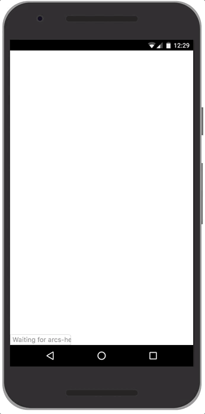

# Getting Started: Hello, World!

[Code](https://glitch.com/edit/#!/arcs-hello-world?path=arc.manifest)
[Demo](https://arcs-hello-world.glitch.me/)

In this section we will go through a "Hello, World!" Arcs example to illustrate the basic Arcs concepts of particles and recipes.

In Arcs, a particle is a simple program that contains a bit of JavaScript and a [manifest](https://github.com/PolymerLabs/arcs/blob/master/runtime/manifest.md) file that describes what the particle does. A particle has a verb, can have inputs and outputs and may render UI to interact with the user. Arcs particles - potentially written by many different authors - can be combined and composed into Arcs recipes that perform a higher-level assistive function for the user. In our example the "Hello, World!" recipe combines together three particles to greet the user:

*   The *[HelloWorld](https://glitch.com/edit/#!/arcs-hello-world?path=particles/HelloWorld/HelloWorld.manifest)* particle has no input and no UI. It simply outputs an entity of type "Message" that holds the greeting message: "Hello, World!".
*   The *[Greet](https://glitch.com/edit/#!/arcs-hello-world?path=particles/Greet/Greet.manifest)* particle takes as input a singleton of type Message and renders it in the DOM.

These two particles would be enough to display a simple "Hello, World!" message. To demonstrate how particles can be used to compose UI, without needing to know about each other, we introduce a third particle:

*   The *[PersonalGreet](https://glitch.com/edit/#!/arcs-hello-world?path=particles/PersonalGreet/PersonalGreet.manifest)* particle takes as input a singleton of type Person and displays a personal greeting message that gets composed into the DOM output from the previous Greet particle.

Every recipe runs inside an Arc. The Arc contains one or more recipes (the code and data flow) and views (the data) that get mapped into the Arc from the user's context (universe of all available data to the Arcs runtime).

When the demo is loaded, the Arcs runtime is initialized by including the [playground script](https://polymerlabs.github.io/arcs-cdn/v0.0.4/playground/playground.html). That script reads the "Hello, World" demo [arc.manifest](https://glitch.com/edit/#!/arcs-hello-world?path=arc.manifest) file and loads it as an Arc into the Arcs context.

Once the Arc is set up, the DEMO will suggest the "Hello, World!" recipe to the user by rendering a suggestion in toast at the bottom of the screen. The recipe gets suggested to the user because all of the inputs and UI affordance required for the recipe to run are available.

Clicking on the suggestion runs all the particles in the recipe and renders their output in the main UI slot. A UI slot corresponds to a named DOM element that particles may render content into. In this example the Greet particle renders a green `
` into the main Arcs UI slot called "root".

This recipe includes a simple illustration of particle composition: the Greet particle exposes a UI slot called "customgreeting" for another particle to render UI into. The PersonalGreet particle expects a "customgreeting" UI slot to be available and renders a yellow `
` into that slot.

Note that these two particles don't need to know about each other (however they both know about the "customgreeting" slot) and would typically be written by different developers.

You can [run the demo](https://arcs-hello-world.glitch.me/) and even [edit the demo](https://glitch.com/edit/#!/arcs-hello-world?path=arc.manifest) hosted on Glitch. In the following sections we pull the demo apart and describe the different parts of the demo in more detail.

## Demo Setup

To setup the demo we simply import [playground.html](https://polymerlabs.github.io/arcs-cdn/v0.0.4/playground/playground.html) in the main `index.html` file. The playground does all of the initialization of the Arcs environment and expects an `arc.manifest` file to be hosted in the same directory as the `index.html` file.

Eventually, Arcs will be spawned automatically based on user context. In the demo, the Arc is explicitly loaded via the `arc.manifest` file that represents a serialized representation of the demo Arc. That manifest file declares the following:

 * a view named `User` of type `Person` whose content is specified in `user.json`.
 * a list of recipes that should be included into the Arc.
 * a recipe that stitches together three particles (HelloWorld, Greet and PersonalGreet).

## Recipes

The recipe declares the particles that constitute (and run as part of) the program as well as how data flows through the particles in the Arc. Recipes can be hosted anywhere on the web and will eventually get crawled and indexed by Arcs. The same [manifest format](https://github.com/PolymerLabs/arcs/blob/master/runtime/manifest.md) is used to describe entity schemas (data types), views (sets of data), particles (code) and recipes (data flow).

For this simple demo we have five different manifest files. One for every particle, one that defines the `Message` schema and one that pulls it all together and describes the recipe and the Arc. Take a look at the [arcs.manifest](https://glitch.com/edit/#!/arcs-hello-world?path=arc.manifest) file and its comments for a closer look at how the higher-level recipe is specified.

## Slots

Slots are named UI placeholders where particles can render content into. E.g., the Arcs playground exposes a root slot that the Greet particle renders into.

Slots are also the mechanism by which UI composes in Arcs. E.g., the Greet particle renders DOM inside the root slot and exposes a new slot for another particle to render additional content into its DOM. The Greet DOM output contains the following tag: `

`. The PersonalGreet particle can then specify in its manifest that it wants to be rendered into the 'customgreeting' slot.

TODO: describe more complex slot composition (e.g., set slots).

## Particles

A particle is the basic unit of computation in Arcs. Simply put it's a JavaScript file that contains a class that inherits either from [DomParticle](https://github.com/PolymerLabs/arcs/blob/master/runtime/dom-particle.js) (if the particle renders DOM UI) or from its parent class [Particle](https://github.com/PolymerLabs/arcs/blob/master/runtime/particle.js) (if it only operates on input and output views). Take a look at the [Greet](https://glitch.com/edit/#!/arcs-hello-world?path=particles/Greet/Greet.manifest) particle manifest and its accompanied [JavaScript file](https://glitch.com/edit/#!/arcs-hello-world?path=particles/Greet/Greet.js).

Particles may gain access to sensitive user data through input views. To avoid data leaks and protect user privacy, particles run isolated from other particles and have limited capabilities. Particles don't have direct access to traditional storage, DOM or even network resources. Instead, particles may have side effects by writing to output views or by rendering (sanitized) DOM content into UI slots. The Arcs runtime is responsible for instantiating particles inside the Arc and for persisting views across ephemeral particle invocations.

Particle authors can write to output views that behave as sets of entities ([interface definition](https://polymerlabs.github.io/arcs-cdn/v0.0.4/index.html)). An example of that is the HelloWorld particle that writes to a singleton output view (which is essentially a set of size 1) called hello of type Message.

Particles may also output DOM UI. Particles that output any DOM can inherit from DomParticle. E.g., Greet takes as input a singleton view of type Message and renders that message to DOM.

It's important to note that DOM particles don't have unrestricted access to the main DOM. That would give particle authors a way to leak sensitive user data. Instead, DOM particles render templated shadow DOMs into slots that get sanitized before being rendered into the main DOM by the Arcs runtime. DomParticle uses the Xen templates. See the [Xen Template Explainer](https://polymerlabs.github.io/arcs-cdn/v0.0.4/components/xen-explainer.html) for a list of features.

The Arcs library also includes various web components to allow more complex features such as rendering a list of templated content. A complete list of supported web components can be found [here](https://github.com/PolymerLabs/arcs/tree/master/runtime/browser/lib).
